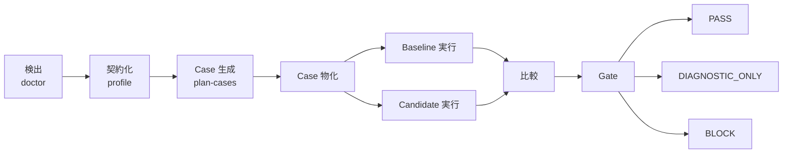

# Agent Workflow Bench

**Coding Agent ワークフロー向けの、証拠優先の回帰テストとリリースゲート。**

[English](README.md) · [简体中文](README.zh-CN.md) · [日本語](README.ja.md)

Agent Workflow Bench（AWB）は最終回答だけでなく、Coding Agent を取り巻く
ワークフロー全体を評価します。ルール、Skill、Hook、サブエージェント、
ルーティング、Handoff、Gate、成果物、状態、予算、副作用ポリシー、復旧が対象です。

正式な製品名は **Agent Workflow Bench** です。package、repository、plugin、
Skill、command の canonical slug は `agent-workflow-bench`、CLI は `awb` です。

> AWB は evidence-first です。決定論的な契約違反と無効な provenance は、
> 集計スコアや AI 判定より優先されます。シミュレーション、不完全、比較不能な
> 証拠から実際の CI PASS を生成することはできません。

## AWB の役割

AWB はワークフローの期待値をバージョン管理された契約に変換し、カバレッジを導出し、
実行可能な Case を生成します。証拠を収集し、揃った baseline と candidate を比較して、
決定論的なリリース判定を返します。



| 評価領域 | 例 |
| --- | --- |
| 契約整合性 | Entrypoint、Role、Owner、Status、必須 Join |
| Routing と Gate | 禁止 Route、Owner bypass、false PASS、callback 欠落 |
| 成果物と状態 | ファイル欠落、誤パス、古い・不正な状態 |
| 副作用 | 禁止 Command、外部書き込み、本番操作 |
| 実行品質 | 必須証拠、完了、割り込み後の復旧 |
| 効率 | 実行時間、Retry、重複作業、Token 使用量 |
| Harness 品質 | Coverage、Mutation kill rate、false negative、再現性 |

## インストール

### 要件

- Node.js と npm。現行 LTS を推奨します。
- 対応する live runner には Codex または Claude Code が必要です。
- simulated 実行には実際の Coding Agent CLI は不要です。

例の `GITHUB_OWNER` は、リポジトリをホストするアカウントまたは組織に置き換えてください。

### ソースから実行

```bash
git clone https://github.com/GITHUB_OWNER/agent-workflow-bench.git
cd agent-workflow-bench
npm install
npm run validate
npm run benchmark -- --help
```

### Codex Plugin

```bash
codex plugin marketplace add \
  https://github.com/GITHUB_OWNER/agent-workflow-bench \
  --ref main

codex plugin add \
  agent-workflow-bench@agent-workflow-bench
```

### Claude Code Plugin

Claude Code 内で実行します。

```text
/plugin marketplace add GITHUB_OWNER/agent-workflow-bench
/plugin install agent-workflow-bench@agent-workflow-bench
/reload-plugins
```

Plugin には自己完結した JavaScript runtime、schema、config、fixture、Skill、
command、`bin/awb` wrapper が含まれます。

## クイックスタート

次の安全なローカルフローは live Coding Agent を呼び出さずに、検出、ペア比較、
Gate までを実行します。

```bash
awb doctor \
  --target minimal-directory-agent \
  --runner simulated \
  --out reports/doctor

awb run \
  --target minimal-directory-agent \
  --runner simulated \
  --execution simulated \
  --out reports/regression/baseline

awb run \
  --target minimal-directory-agent \
  --runner simulated \
  --execution simulated \
  --out reports/regression/candidate

awb compare \
  --baseline reports/regression/baseline \
  --candidate reports/regression/candidate \
  --out reports/regression/comparison

awb gate \
  --comparison reports/regression/comparison/comparison-result.json \
  --out reports/regression/gate
```

最後のコマンドは終了コード `2` を返します。これは想定どおりです。simulated
証拠は harness と scorer を検証できますが、`DIAGNOSTIC_ONLY` のままです。

ソース checkout では `awb ...` を `npm run benchmark -- ...` に置き換えられます。

## CI Gate と信頼境界

### Gate 判定

| 判定 | 終了コード | 意味 |
| --- | ---: | --- |
| `PASS` | `0` | 資格認定済みの独立 live `workflow_trace` で阻害回帰なし |
| `DIAGNOSTIC_ONLY` | `2` | simulated、未認定 Observer、不完全、または比較不能な証拠 |
| `BLOCK` | `1` | Hard Failure、回帰、無効 provenance、Tool Failure |

現在実装済みの Hard Failure は常にスコアより優先されます。禁止 routing、Owner
bypass、false PASS、必須 Join 欠落、artifact path drift、危険な本番副作用、無効
provenance、未登録 failure code が対象です。runner failure と telemetry 不足は別の
決定論的 BLOCK/診断条件であり、追加の registry code ではありません。

### 現在の Runner 証拠

| Runner | 現在の証拠境界 | Gate への影響 |
| --- | --- | --- |
| Codex | live `contract_summary` | 外部観測なしでは診断専用 |
| Claude Code | live `contract_summary` | 外部観測なしでは診断専用 |
| OpenCode | capability detection | Adapter が必要 |
| Simulated | synthetic events | Harness/scorer 検証専用 |

### 署名付き Workflow Trace

独立 observer は、正規化した Trace 全体を Ed25519 で署名できます。AWB には
署名済み Trace と、別に設定された公開鍵だけを渡します。

```bash
awb ingest-trace \
  --cases-dir cases/generated/my-workflow \
  --suite full \
  --trace observer-output/workflow-trace.json \
  --trusted-observer-key ci/observer-public.pem \
  --out reports/observed/baseline

awb compare \
  --baseline reports/observed/baseline \
  --candidate reports/observed/candidate \
  --trusted-observer-key ci/observer-public.pem \
  --out reports/observed/comparison

awb gate \
  --comparison reports/observed/comparison/comparison-result.json \
  --trusted-observer-key ci/observer-public.pem \
  --out reports/observed/gate
```

AWB は署名、Case Set、Lifecycle 証拠、provenance、runtime manifest、
comparison snapshot、Gate 再計算を再検証します。Trace 改ざん、誤った鍵、
Case 欠落、必須証拠欠落、trust anchor 欠落は PASS できません。

署名が証明するのは observer の identity と署名後の完全性です。observer の
観測完全性や OS/Network isolation までは証明しません。公開鍵を release trust root
に追加する前に observer を検証してください。仕様は
[Workflow-Trace Observer Contract](docs/workflow-trace-observer-contract.md) を参照してください。
現在の Stage 1 admission は `qualificationStatus: missing` を記録するため、署名と
公開鍵の検証に成功しても `DIAGNOSTIC_ONLY` です。実際の `GATE-PASS` は Stage 3
の integrity-bound qualification artifact が検証された後にのみ利用できます。
編集可能な run metadata で `valid` を自己申告しても無視されます。

## よく使うワークフロー

### Baseline/Candidate ペア回帰

隔離した checkout を使い、target contract、Case Set、runner、権限、予算、
検証条件を揃えます。

```bash
awb run \
  --target my-workflow \
  --target-root <baseline-checkout> \
  --runner codex \
  --execution live \
  --mode diagnostic \
  --out reports/regression/baseline

awb run \
  --target my-workflow \
  --target-root <candidate-checkout> \
  --runner codex \
  --execution live \
  --mode diagnostic \
  --out reports/regression/candidate

awb compare \
  --baseline reports/regression/baseline \
  --candidate reports/regression/candidate \
  --out reports/regression/comparison
```

Claude Code では `--runner claude` を使います。組み込み live adapter は、
信頼済み Workflow Trace として受理されるまでは診断専用です。

### 1 コマンド評価

```bash
awb evaluate \
  --target my-workflow \
  --target-root <candidate-checkout> \
  --planner-runner codex \
  --runner codex \
  --coverage-mode full \
  --execution live \
  --out reports/evaluations/my-workflow
```

`smoke` は高速確認、`full` は広い契約カバレッジ、`adaptive` は欠落 Coverage
向けの追加 Case 生成に使います。

### ワークフロー登録

```bash
awb init-target \
  --agent-root path/to/workflow \
  --target-id my-workflow \
  --name "My Workflow" \
  --out configs/targets/my-workflow.draft.yaml
```

生成された gap report を確認し、Owner、Join、Route、Artifact、State、予算、
Command Policy を確定してから、レビュー済み Target Pack を登録します。
自動生成 draft は Owner が確認するまで信頼済み契約ではありません。

### Self-Debug と Mutation 検証

```bash
awb debug reverse-validate \
  --target my-workflow \
  --suite smoke \
  --mutation-set fixtures/mutations/extended.yaml \
  --runner simulated \
  --out .benchmark-debug/my-workflow
```

Mutation overlay は scorer と oracle を検証します。Target Source は変更せず、
live runner の挙動を証明するものでもありません。

### Gate Policy の校正

Gold Corpus の development/calibration データだけで versioned policy を fitting します。

```bash
awb gate-policy calibrate \
  --corpus fixtures/gold-corpus/v1/manifest.yaml \
  --policy-version 1.0.0 \
  --out reports/gate-policy/v1/fit
```

このコマンドは `gate-policy.json`、`calibration-report.json`、
`calibration-report.md` を書き、終了コード `2` を返します。これは
`PENDING_HOLDOUT` であり、holdout label を fit に使っていないためです。P0 recall
`1` と false PASS `0` を維持する candidate がなければ、policy を出力せず終了
コード `1` を返します。凍結した policy は別に unseen holdout で検証します。

```bash
awb gate-policy validate-holdout \
  --corpus fixtures/gold-corpus/v1/manifest.yaml \
  --policy reports/gate-policy/v1/fit/gate-policy.json \
  --calibration-report reports/gate-policy/v1/fit/calibration-report.json \
  --out reports/gate-policy/v1/holdout
```

holdout 検証は `PASS` なら `0`、`FAIL` なら `1` を返します。Stability は synthetic
harness 全体の deterministic replay であり、live-run reliability ではありません。
Public Gold Corpus の PASS は harness diagnostic であり、`releaseEligible: false` のままです。実際の
criterion validity、human labels、qualified live trace、本番 blocking authorization
は別途必要です。詳しくは
[Gate Policy Calibration](docs/gate-policy-calibration.md) を参照してください。

Committed public synthetic evidence は `fixtures/calibration/v1/fit` と
`fixtures/calibration/v1/holdout` にあります。

## コマンドと成果物

| Command | 目的 |
| --- | --- |
| `doctor` | Target、runner、証拠 readiness の検出 |
| `init-target` | レビュー可能な Target Pack draft の生成 |
| `profile` | 安定した `ContractModel` の構築 |
| `plan-cases` | 契約由来 Coverage から Case を生成 |
| `materialize` | 実行可能な Case YAML と manifest を生成 |
| `run` | Case または Suite を実行 |
| `evaluate` | Profile、計画、Case、Score、Report を実行 |
| `ingest-trace` | 独立署名済み live trace の検証と採点 |
| `compare` | 揃った baseline/candidate 証拠を比較 |
| `gate` | 決定論的 CI release policy の適用 |
| `gate-policy ...` | Versioned score/gate policy の校正または holdout 検証 |
| `score` / `report` | Run 確認、decision、trace-diff、trend、静的 viewer の描画 |
| `criterion-validity ...` | 盲検化した外部研究 package の生成・独立ラベル分析 |
| `debug ...` | Benchmark Harness の逆検証と診断 |

| Artifact | 目的 |
| --- | --- |
| `contract-model.json` | 正規化 Target Contract |
| `ai-case-plan-validation.json` | Coverage と Binding の検証 |
| `events/*` / `case-results/*` | Case ごとの証拠と Verdict |
| `suite-result.json` | 単一 Run の集計 |
| `runtime-manifest.json` | 観測された runner/runtime の事実 |
| `provenance.json` | Target、Case、環境、完全性の identity |
| `workflow-trace.json` | 独立署名済みの正規化 live trace |
| `comparison-result.json` | 完全性に結び付いたペア比較 |
| `gate-result.json` | 決定論的リリース判定 |
| `gate-policy.json` / `calibration-report.*` | Versioned policy、fit evidence、holdout diagnostics |
| `report.md` / `decision-report.*` / `trace-diff.json` / `trend-report.json` / `viewer.html` | 診断、判定、Redacted trace diff、era 別 trend、静的 viewer |
| `validity-report.*` / `reliability-report.*` | 外部妥当性、信頼性、quarantine の証拠 |

完全なオプションは `awb <command> --help` で確認できます。

`compare` と `gate` は `--gate-policy <path>` を受け取ります。履歴結果の再計算では
同じ policy を使ってください。policy version、rules hash、policy hash が欠落または
不一致の場合、AWB は結果を比較不能として扱います。

## セキュリティとプライバシー

- `--target-root` で baseline と candidate を隔離します。
- simulated fixture は外部 Agent を呼び出しません。
- 永続化 Artifact から一般的な Credential、Email、絶対 Path を除去します。
- provenance は結果を Target、Git、Config、Case、Runner、Artifact に結び付けます。
- Trace は署名前に Redaction が必要です。
- observer の秘密鍵を評価対象 runner に渡してはいけません。
- 決定論的な副作用違反は集計スコアより優先されます。
- Enterprise Target Pack は Public Core の外部に保持してください。

信頼できない Target を本番 Credential や Service に接続しないでください。
Diagnostic Prompt 自体は Sandbox ではありません。

## 開発

```bash
npm install
npm run typecheck
npm test
npm run validate
npm run plugin:build
```

ソース checkout の外から packaged runtime を検証します。

```bash
plugins/agent-workflow-bench/bin/awb validate-schema
```

`plugins/agent-workflow-bench/runtime/` は commit 対象の生成物です。runtime behavior、
schema、config、fixture を変更したら `npm run plugin:build` を実行してください。

```text
.
├── configs/                     # Runner Config と Target Pack
├── fixtures/                    # 汎用 Target と Mutation Scenario
├── plugins/agent-workflow-bench # Codex/Claude Plugin と Bundled Runtime
├── schemas/                     # 機械可読 Artifact Contract
├── src/                         # TypeScript CLI
├── tests/                       # Unit / End-to-End Test
└── docs/                        # Methodology と運用ガイド
```

## ドキュメント

- [Human guide](docs/agent-workflow-bench-human-guide.md)
- [Plugin guide](docs/agent-workflow-bench-plugin-guide.md)
- [Evaluation methodology](docs/ai-workflow-evaluation-methodology.md) / [Reporting and trends](docs/reporting-and-trends.md)
- [Workflow-Trace Observer Contract](docs/workflow-trace-observer-contract.md)
- [English README](README.md) / [简体中文 README](README.zh-CN.md)

## ライセンス

Agent Workflow Bench は [MIT License](LICENSE) で公開されています。
