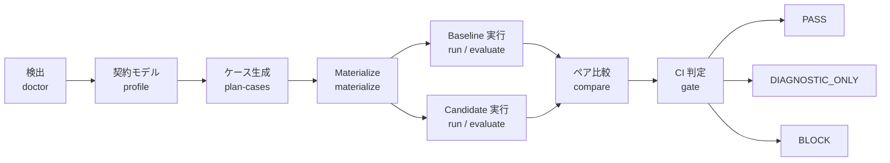
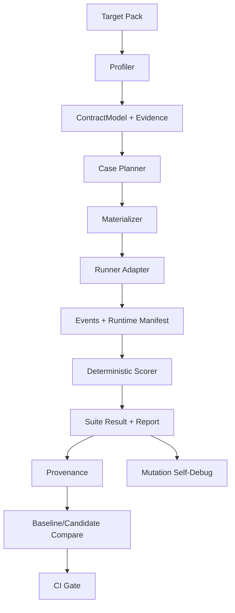

# Agent Workflow Bench

**Coding Agent ワークフロー向けの CI グレード回帰テストとリリースゲート。**

[English](README.md) · [简体中文](README.zh-CN.md) · [日本語](README.ja.md)

Agent Workflow Bench（AWB）は、Codex や Claude Code などの Coding Agent
ワークフローを検出、評価、比較、ゲート判定するためのツールです。単一のプロンプトや
モデル応答だけでなく、ルール、Skills、Hooks、サブエージェント、ルーティング、
Handoff、Gate、成果物、状態、予算、副作用ポリシーを含むワークフロー全体を対象に
します。

製品表示名は **Agent Workflow Bench** です。互換性のため CLI は `awb`、
package、plugin、repository の slug は `agent-workflow-benchmark` のままです。

> AWB は evidence-first です。決定論的な契約違反と無効な provenance は、
> 総合スコアや AI 判定より優先されます。シミュレーション、不完全、または比較不能な
> 証拠から実際の CI PASS を生成することはありません。

## AWB が必要な理由

Coding Agent ワークフローはソフトウェアシステムに近い性質を持ちますが、多くの変更は
ソフトウェア品質の回帰証拠なしに行われています。ルール、Skill、Hook、ルーティング、
サブエージェント契約の小さな変更でも、次の挙動が変わる可能性があります。

- どのエージェントがタスクを所有するか。
- 必須 Review、Join、Callback が実行されるか。
- Gate が正直に PASS を報告するか。
- 成果物と状態が正しい場所に保存されるか。
- どのツールや副作用が許可されるか。
- 時間とコンテキストをどれだけ消費するか。
- 中断後に再開できるか。

AWB はこれらの期待をバージョン管理可能な Target Pack にし、実行可能なケースを生成
または materialize し、追跡可能な証拠を収集します。さらに、同一条件の baseline と
candidate を比較し、決定論的なリリース判定を返します。

## コアフロー



推奨エントリーポイント：

1. `awb doctor` — Target と runner を検出し、証拠の上限を明示します。
2. `awb run` または `awb evaluate` — 隔離された baseline/candidate を実行します。
3. `awb compare` — 同一条件の証拠を比較します。
4. `awb gate` — 機械可読・人間可読の CI 判定を出力します。

既存の profile、計画、materialize、scoring、report、P0、self-debug コマンドも
引き続き利用できます。

## 評価対象

| 領域 | 例 |
| --- | --- |
| 契約の完全性 | Entrypoint、Role、Owner、Status、必須 Join |
| ルーティング | 必須 Route、禁止 Route、Callback Owner |
| Gate | 偽 PASS、必須チェックの省略、不正な終端状態 |
| 成果物と状態 | 欠落ファイル、誤ったパス、Owner 違反、古い状態 |
| 副作用 | 禁止コマンド、外部書き込み、本番操作 |
| 実行品質 | 必須証拠、実際の完了、復旧動作 |
| 効率 | 実行時間、Retry、重複作業 |
| Token | Input、Output、Total、Waste、Confidence |
| 説明可能性 | Oracle ID、Score cap、Hard failure、Provenance |
| Harness 品質 | Mutation kill rate、False negative、再現性 |

## 機能一覧

| コマンド | 目的 | 主な出力 |
| --- | --- | --- |
| `awb doctor` | Target、runner、証拠準備状況を検出 | `doctor-result.json`、`doctor-report.md` |
| `awb init-target` | レビュー可能な Target Pack ドラフトを生成 | Target YAML、Gap report |
| `awb profile` | 安定した `ContractModel` を構築 | Profile evidence、Contract JSON |
| `awb plan-cases` | Codex、Claude、fixture でケースを生成 | AI plan、Validation report |
| `awb materialize` | Plan/template を実行可能 YAML に変換 | Cases、Manifest、Applicability |
| `awb run` | Case または suite を実行 | Events、Results、Provenance、Recommendations |
| `awb evaluate` | 評価パイプライン全体を実行 | Profile、Plan、Cases、Report、P0 |
| `awb compare` | Baseline と candidate を比較 | Comparison JSON、Markdown |
| `awb gate` | 決定論的 CI ポリシーを適用 | Gate JSON、Markdown、Exit code |
| `awb score` | 既存 Run の判定とスコアを表示 | JSON summary |
| `awb report` | 読みやすいレポートを生成 | Markdown、JSON |
| `awb debug ...` | Benchmark harness を検証・改善 | Dossier、Repair plan、Result |

完全なオプションは `awb <command> --help` で確認できます。

## 証拠と判定モデル

### 比較分類

`awb compare` は次のいずれかを返します。

| 分類 | 意味 |
| --- | --- |
| `IMPROVED` | Candidate が同一条件の baseline より改善 |
| `REGRESSED` | Candidate に測定可能な退行がある |
| `UNCHANGED` | 同一条件で重要な変化がない |
| `MIXED` | 改善と退行が共存 |
| `HARD_FAILURE` | Candidate の決定論的 failure が結果を支配 |
| `INCOMPARABLE` | 条件または provenance が比較を許可しない |

### ペア CI Gate

`awb gate` は独立した 3 状態のリリース契約を使用します。

| 判定 | Exit code | 意味 |
| --- | ---: | --- |
| `PASS` | `0` | 信頼できる live `workflow_trace` があり、ブロック対象の退行がない |
| `DIAGNOSTIC_ONLY` | `2` | 証拠が simulated、不完全、または比較不能 |
| `BLOCK` | `1` | Hard failure、退行、無効 provenance、または tool failure |

本番副作用、Owner bypass、偽 PASS、禁止 routing、必須 Join の欠落、重要成果物の欠落、
無効 provenance などの hard failure は常にスコアより優先されます。

各 comparison は baseline/candidate の suite、provenance、runtime manifest を
`evidence/` 配下へ snapshot し、hash と comparison payload を結合します。
`awb gate` は bundle を再検証して comparison を再計算するため、編集された
comparison または evidence file は `GATE-COMPARISON-INTEGRITY` で BLOCK
されます。さらに runtime の実行事実を provenance および adapter が宣言した
証拠上限と照合するため、編集可能な hash の再計算だけで simulated または
contract-summary の Run を `workflow_trace` に昇格させることはできません。

後方互換のため、単一 Run の `suite-result.json` は `APPROVE`、
`CONDITIONAL_APPROVE`、`BLOCK`、`DIAGNOSTIC_ONLY` を維持します。ペア CI Gate は
`PASS`、`DIAGNOSTIC_ONLY`、`BLOCK` を使用します。

### 証拠レベル

AWB は証拠の出所と観測境界を明示します。

- **Live workflow trace** — 信頼でき、完全な場合は PASS の対象。
- **Live contract summary** — 診断には有効ですが PASS には不十分。
- **Simulated events** — 決定論的な harness/scorer 検証専用。
- **Inferred evidence** — 記録された事実から導出した解釈。
- **Unknown** — 欠落または観測不能。

実際の `workflow_trace` を出力する信頼済み adapter だけが、ペア CI PASS を生成
できます。現在の Codex/Claude `contract-summary` adapter と simulated run は、
スコアが高くても `DIAGNOSTIC_ONLY` です。

## Runner サポート

| Runner | ケース計画 | Case 実行 | 現在の証拠境界 |
| --- | --- | --- | --- |
| Codex | Live | Live adapter | Contract summary。Workflow trace なしでは診断のみ |
| Claude Code | Live | Live adapter | Contract summary。Workflow trace なしでは診断のみ |
| OpenCode | Capability detection | Adapter extension point | Capability-only |
| Simulated | Fixture plan | 決定論的ローカル実行 | Synthetic evidence。診断のみ |

Runner version、実行可能性、Token confidence、execution mode、comparability は
provenance に保存されます。

## インストール

### 要件

- Node.js と npm。現行 LTS を推奨します。
- 対応する live runner を使用する場合は Codex または Claude Code。
- Private remote からインストールする場合は Git アクセス権。

Simulated run では Coding Agent CLI は不要です。

インストール例の `GITHUB_OWNER` は、このリポジトリをホストする GitHub アカウント
または Organization に置き換えてください。

### ソースから実行

```bash
git clone https://github.com/GITHUB_OWNER/agent-workflow-benchmark.git
cd agent-workflow-benchmark
npm install
npm run validate
```

TypeScript CLI を実行します。

```bash
npm run benchmark -- --help
npm run benchmark -- doctor \
  --target minimal-directory-agent \
  --runner simulated \
  --out reports/doctor
```

以下では `awb ...` を使用します。ソース checkout では
`npm run benchmark -- ...` に置き換えられます。

### Codex Plugin

```bash
codex plugin marketplace add \
  https://github.com/GITHUB_OWNER/agent-workflow-benchmark \
  --ref main

codex plugin add \
  agent-workflow-benchmark@agent-workflow-benchmark
```

### Claude Code Plugin

Claude Code 内で実行：

```text
/plugin marketplace add GITHUB_OWNER/agent-workflow-benchmark
/plugin install agent-workflow-benchmark@agent-workflow-benchmark
/reload-plugins
```

Plugin には compiled JavaScript runtime、schemas、configs、fixtures、Skill、
`bin/awb` wrapper が含まれます。インストール後はソース checkout に依存しません。
初回実行時に wrapper が plugin cache 内へ production dependencies をインストール
します。

## Quick Start：安全な Simulated 回帰

Live Agent を呼び出さずに discovery、baseline/candidate compare、gate を確認できます。

```bash
awb doctor \
  --target minimal-directory-agent \
  --runner simulated \
  --out reports/doctor

awb run \
  --target minimal-directory-agent \
  --runner simulated \
  --execution simulated \
  --out reports/regression/baseline

awb run \
  --target minimal-directory-agent \
  --runner simulated \
  --execution simulated \
  --out reports/regression/candidate

awb compare \
  --baseline reports/regression/baseline \
  --candidate reports/regression/candidate \
  --out reports/regression/comparison

awb gate \
  --comparison reports/regression/comparison/comparison-result.json \
  --out reports/regression/gate
```

Simulated evidence は診断専用のため、最後のコマンドは exit code `2` を返します。
これは期待される結果です。

## Baseline/Candidate ペア回帰

2 つの隔離 checkout を使用し、task、Target Pack、case set、runner、execution mode、
permissions、budget、validation conditions を一致させます。

```bash
awb doctor \
  --target my-workflow \
  --target-root <baseline-checkout> \
  --runner codex \
  --out reports/doctor-baseline

awb run \
  --target my-workflow \
  --target-root <baseline-checkout> \
  --runner codex \
  --execution live \
  --mode diagnostic \
  --out reports/regression/baseline

awb run \
  --target my-workflow \
  --target-root <candidate-checkout> \
  --runner codex \
  --execution live \
  --mode diagnostic \
  --out reports/regression/candidate

awb compare \
  --baseline reports/regression/baseline \
  --candidate reports/regression/candidate \
  --out reports/regression/comparison

awb gate \
  --comparison reports/regression/comparison/comparison-result.json \
  --out reports/regression/gate
```

Claude では runner を `claude` に変更します。最終 Gate が PASS するには、カスタム
adapter が信頼できる workflow-trace evidence を提供する必要があります。

## 1 コマンド評価

`evaluate` は AI-first パイプラインを維持し、詳細な診断、推奨事項、P0 永続化に
利用できます。

```bash
awb evaluate \
  --target my-workflow \
  --target-root <candidate-checkout> \
  --planner-runner codex \
  --runner codex \
  --coverage-mode full \
  --execution live \
  --out reports/evaluations/my-workflow
```

決定論的なローカル検証：

```bash
awb evaluate \
  --target minimal-directory-agent \
  --planner-runner fixture \
  --runner simulated \
  --coverage-mode smoke \
  --execution simulated \
  --out reports/evaluations/minimal-directory-agent
```

Coverage mode：

- `smoke` — 上限のある高速フィードバック。
- `full` — 広い契約カバレッジ。
- `adaptive` — 不足カバレッジに集中した追加生成。

`--max-cases` は 1 回の plan 数を制限するだけで、完全な coverage を証明しません。

## 新しいワークフローの登録

Target Pack ドラフトを生成します。

```bash
awb init-target \
  --agent-root path/to/workflow \
  --target-id my-workflow \
  --name "My Workflow" \
  --target-type directory \
  --out configs/targets/my-workflow.draft.yaml
```

生成された gap report とともに次を確認します。

- Entrypoint と Role。
- Owner scope と required owner。
- Status と GatePolicy。
- 必須 Join と Callback。
- Artifact と State path。
- 禁止 Route。
- Wall-clock と Token budget。
- 許可 Command と禁止 Argument。

レビュー後、`configs/targets/my-workflow.yaml` へ移動し、
`configs/targets/registry.yaml` に登録します。Workflow Owner がレビューするまで、
生成されたドラフトは信頼済み契約ではありません。

Target type：

- `directory` — ディレクトリ内のルール、Skills、Hooks、State。
- `cli` — Command-driven workflow。
- `hybrid` — Directory contract と executable entrypoint。

## 主な成果物

| 成果物 | 目的 |
| --- | --- |
| `doctor-result.json` | 準備状況と evidence ceiling |
| `contract-model.json` | 正規化された workflow contract |
| `profile-evidence.json` | Hash 付き構造証拠 |
| `ai-case-plan.json` | 生成された case plan |
| `ai-case-plan-validation.json` | Coverage と binding validation |
| `manifest.json` | Materialized case と hash |
| `events/*.jsonl` | Runner/simulator の構造化 event |
| `case-results/*.json` | Case verdict、score、evidence、failure |
| `suite-result.json` | 単一 Run 集計 |
| `runtime-manifest.json` | Runner/runtime capability |
| `provenance.json` | Target、Git、config、runner、environment、integrity hash |
| `recommendations.json` / `.md` | 優先順位付き workflow 改善案 |
| `p0-cases.json` / `.md` | 永続化可能な hard-failure record |
| `comparison-result.json` | Evidence integrity と結合した classification |
| `gate-result.json` | 決定論的なペア CI 判定 |
| `report.md` | 人間向け評価レポート |

永続化成果物には raw source excerpt、credential、ローカル絶対パス、個人識別情報、
environment secret を残さない設計です。

## スコアリングと説明可能性

各 case result には次を含められます。

- Raw score と capped score。
- Verdict と hard-failure code。
- Telemetry completeness。
- Contract、routing、ownership、gate、artifact、join、side-effect、efficiency、
  runner dimensions。
- Wall-clock duration。
- Input/output/total/wasted token と confidence。
- Oracle と score provenance。
- Workflow、efficiency、token-cost comparability。

Suite result はこれらを集計し、recommendation と P0 record を生成します。Score は
診断を説明するためのものであり、決定論的 hard failure や未観測の事実を上書き
しません。

## Self-Debug と Mutation Validation

AWB は scorer と oracle が既知の悪いシグナルを検出できるかを検証できます。
Mutation validation は overlay と simulated runner を使い、Target source を変更
しません。

```bash
awb debug prepare-env \
  --target my-workflow \
  --suite smoke \
  --runner codex \
  --out .benchmark-debug/my-workflow-env

awb debug reverse-validate \
  --target my-workflow \
  --suite smoke \
  --mutation-set fixtures/mutations/extended.yaml \
  --runner simulated \
  --suite-result reports/runs/my-workflow/suite-result.json \
  --out .benchmark-debug/my-workflow

awb debug diagnose \
  --debug-run .benchmark-debug/my-workflow \
  --out .benchmark-debug/my-workflow/diagnosis

awb debug propose-fix \
  --dossier .benchmark-debug/my-workflow/diagnosis/debug-dossier.json \
  --out .benchmark-debug/my-workflow/diagnosis/repair-plan.md
```

Debug health は Target workflow score と分離して表示されます。

## セキュリティとプライバシー

AWB は隔離環境での回帰テストを前提に設計されています。

- `--target-root` で baseline と candidate を分離。
- Simulated fixture は外部 Agent を呼び出さない。
- Codex live 実行は read-only/no-approval sandbox を要求し、Claude live 実行は
  Claude CLI の runner default を使用。現在の両 adapter は diagnostic-only。
- 決定論的 side-effect failure は score より優先。
- Provenance は Target、Git、config、case、runner、artifact を結合。
- Planner の永続化成果物に raw source excerpt と raw model output を残さない。
- Credential、email、absolute path、一般的な secret format を redaction。
- Public core は generic fixture のみを持ち、enterprise target は外部入力。

信頼できない Target を production credential や production service に接続しないで
ください。Diagnostic prompt 自体は sandbox ではありません。

## アーキテクチャ



Runner interface は拡張可能です。Workflow 固有の live observation は generic core
ではなく adapter に実装します。

## 開発と検証

```bash
npm install
npm run typecheck
npm test
npm run validate
npm run plugin:build
```

Plugin wrapper を検証：

```bash
plugins/agent-workflow-benchmark/bin/awb validate-schema
```

`plugins/agent-workflow-benchmark/runtime/` の生成物はリポジトリに含まれます。
Runtime behavior、schema、config、fixture に影響する変更では bundled runtime の
再生成と検証が必要です。

リポジトリ構成：

```text
.
├── configs/                         # Runner config と Target Pack
├── fixtures/                        # Generic target と Mutation scenario
├── plugins/agent-workflow-benchmark # Codex/Claude Plugin と bundled runtime
├── schemas/                         # Machine-readable artifact contract
├── src/                             # TypeScript CLI
├── tests/                           # Unit/E2E tests
└── docs/                            # Methodology と operation guide
```

## 現在の制約

- 現在の Codex/Claude live adapter は contract-summary evidence を提供しますが、
  Target entrypoint execution や tool trace を独立観測しません。
- OpenCode は capability detection と runner metadata に対応しています。Live
  execution には adapter が必要です。
- Native token usage は runner が公開した場合だけ記録し、それ以外は source と
  confidence を unavailable とします。
- Workflow、efficiency、token の全軸が comparable の場合だけ cross-runner ranking
  を出力します。
- 初回実行時、plugin cache 内に runtime dependencies をインストールします。

## 関連ドキュメント

- [Human guide](docs/agent-workflow-benchmark-human-guide.md)
- [Plugin guide](docs/agent-workflow-benchmark-plugin-guide.md)
- [Evaluation methodology](docs/ai-workflow-evaluation-methodology.md)
- [English README](README.md)
- [简体中文 README](README.zh-CN.md)
