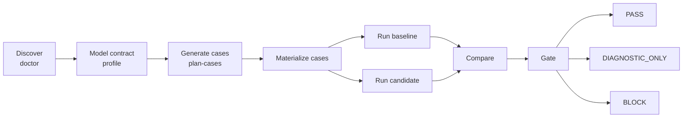

# Agent Workflow Bench

**Evidence-first regression testing and release gates for coding-agent workflows.**

[English](README.md) · [简体中文](README.zh-CN.md) · [日本語](README.ja.md)

Agent Workflow Bench (AWB) evaluates the workflow around a coding agent—not
just its final answer. It tests rules, skills, hooks, sub-agents, routing,
handoffs, gates, artifacts, state, budgets, side-effect policy, and recovery.

The canonical product name is **Agent Workflow Bench**. The package, repository,
plugin, Skill, and command slug is `agent-workflow-bench`; the CLI is `awb`.

> AWB is evidence-first. Deterministic contract violations and invalid
> provenance take precedence over aggregate scores and AI judgment. Simulated,
> incomplete, or incomparable evidence cannot produce a real CI PASS.

## What AWB Does

AWB turns workflow expectations into a versioned contract, derives coverage,
materializes executable cases, captures evidence, compares matched baseline and
candidate runs, and produces a deterministic release decision.



| Area | Examples |
| --- | --- |
| Contract integrity | Entrypoints, roles, owners, statuses, required joins |
| Routing and gates | Forbidden routes, owner bypass, false PASS, missing callback |
| Artifacts and state | Missing files, wrong paths, stale or invalid state |
| Side effects | Forbidden commands, external writes, production operations |
| Execution quality | Required evidence, completion, interruption recovery |
| Efficiency | Wall-clock time, retries, repeated work, token usage |
| Harness quality | Coverage, mutation kill rate, false negatives, reproducibility |

## Install

### Requirements

- Node.js and npm; use a current LTS release.
- Codex or Claude Code for the corresponding live runner.
- No live agent CLI is required for simulated runs.

Replace `GITHUB_OWNER` with the account or organization hosting the repository.

### From source

```bash
git clone https://github.com/GITHUB_OWNER/agent-workflow-bench.git
cd agent-workflow-bench
npm install
npm run validate
npm run benchmark -- --help
```

### Codex plugin

```bash
codex plugin marketplace add \
  https://github.com/GITHUB_OWNER/agent-workflow-bench \
  --ref main

codex plugin add \
  agent-workflow-bench@agent-workflow-bench
```

### Claude Code plugin

Inside Claude Code:

```text
/plugin marketplace add GITHUB_OWNER/agent-workflow-bench
/plugin install agent-workflow-bench@agent-workflow-bench
/reload-plugins
```

The plugin ships a self-contained JavaScript runtime, schemas, configs,
fixtures, Skill, command, and `bin/awb` wrapper.

## Quick Start

This safe local flow exercises discovery, matched comparison, and the gate
without calling a live coding agent:

```bash
awb doctor \
  --target minimal-directory-agent \
  --runner simulated \
  --out reports/doctor

awb run \
  --target minimal-directory-agent \
  --runner simulated \
  --execution simulated \
  --out reports/regression/baseline

awb run \
  --target minimal-directory-agent \
  --runner simulated \
  --execution simulated \
  --out reports/regression/candidate

awb compare \
  --baseline reports/regression/baseline \
  --candidate reports/regression/candidate \
  --out reports/regression/comparison

awb gate \
  --comparison reports/regression/comparison/comparison-result.json \
  --out reports/regression/gate
```

The final command returns exit code `2`. That is expected: simulated evidence
validates the harness and scorer but remains `DIAGNOSTIC_ONLY`.

Source-checkout users can replace `awb ...` with
`npm run benchmark -- ...`.

## CI Gate and Trust Boundary

### Gate decisions

| Decision | Exit code | Meaning |
| --- | ---: | --- |
| `PASS` | `0` | Qualified independent live `workflow_trace` and no blocking regression |
| `DIAGNOSTIC_ONLY` | `2` | Simulated, unqualified, incomplete, or incomparable evidence |
| `BLOCK` | `1` | Hard failure, regression, invalid provenance, or tool failure |

Implemented hard failures always dominate score: forbidden routing, owner
bypass, false PASS, missing required joins, artifact-path drift, unsafe
production side effects, invalid provenance, and unregistered hard-failure
codes. Runner failure and telemetry insufficiency are separate deterministic
BLOCK/diagnostic conditions, not additional registry entries.

### Current runner evidence

| Runner | Current evidence boundary | Gate consequence |
| --- | --- | --- |
| Codex | Live `contract_summary` | Diagnostic-only without external observation |
| Claude Code | Live `contract_summary` | Diagnostic-only without external observation |
| OpenCode | Capability detection | Adapter required |
| Simulated | Synthetic events | Harness/scorer validation only |

### Signed workflow-trace admission

An independent observer can produce release-grade evidence by signing the
complete normalized trace with Ed25519. AWB receives only the signed trace and
a separately configured public key:

```bash
awb ingest-trace \
  --cases-dir cases/generated/my-workflow \
  --suite full \
  --trace observer-output/workflow-trace.json \
  --trusted-observer-key ci/observer-public.pem \
  --out reports/observed/baseline

awb compare \
  --baseline reports/observed/baseline \
  --candidate reports/observed/candidate \
  --trusted-observer-key ci/observer-public.pem \
  --out reports/observed/comparison

awb gate \
  --comparison reports/observed/comparison/comparison-result.json \
  --trusted-observer-key ci/observer-public.pem \
  --out reports/observed/gate
```

AWB revalidates the signature, case set, lifecycle evidence, provenance,
runtime manifest, comparison snapshot, and gate recomputation. A changed trace,
wrong key, missing case, missing required evidence, or absent trust anchor
cannot produce PASS.

The signature proves observer identity and post-signing integrity. It does not
prove observer completeness or OS/network isolation. Qualify the observer
before admitting its public key as a release trust root. See the
[workflow-trace observer contract](docs/workflow-trace-observer-contract.md).
The current Stage 1 admission path records `qualificationStatus: missing`, so a
signed trace is still `DIAGNOSTIC_ONLY`; `GATE-PASS` is reserved for a later
integrity-bound qualification artifact produced by the Stage 3 qualification
workflow. Editing run metadata to self-assert `valid` is ignored.

## Common Workflows

### Matched baseline/candidate regression

Use isolated checkouts and keep target contract, case set, runner, permissions,
budgets, and validation conditions aligned:

```bash
awb run \
  --target my-workflow \
  --target-root <baseline-checkout> \
  --runner codex \
  --execution live \
  --mode diagnostic \
  --out reports/regression/baseline

awb run \
  --target my-workflow \
  --target-root <candidate-checkout> \
  --runner codex \
  --execution live \
  --mode diagnostic \
  --out reports/regression/candidate

awb compare \
  --baseline reports/regression/baseline \
  --candidate reports/regression/candidate \
  --out reports/regression/comparison
```

Use `--runner claude` for Claude Code. Built-in live adapters remain
diagnostic-only until their runs are admitted through trusted workflow-trace
evidence.

### One-command evaluation

```bash
awb evaluate \
  --target my-workflow \
  --target-root <candidate-checkout> \
  --planner-runner codex \
  --runner codex \
  --coverage-mode full \
  --execution live \
  --out reports/evaluations/my-workflow
```

Use `smoke` for fast feedback, `full` for broad contract coverage, and
`adaptive` to generate follow-up cases for missing coverage.

### Onboard a workflow

```bash
awb init-target \
  --agent-root path/to/workflow \
  --target-id my-workflow \
  --name "My Workflow" \
  --out configs/targets/my-workflow.draft.yaml
```

Review the generated gap report, confirm owners, joins, routes, artifacts,
states, budgets, and command policy, then produce a `contract-validity`
artifact bound to the final `contractHash`. Only a target pack whose
`contractReview.status` is `reviewed` and whose artifact hash and contract hash
validate can be registered. Generated drafts remain schema-valid but
non-gateable.

The current machine contract and validity boundaries are documented in
[evaluation contract traceability](docs/evaluation-contract-traceability.md)
and the [evaluation validity protocol](docs/evaluation-validity-protocol.md).

### Self-debug and mutation validation

```bash
awb debug reverse-validate \
  --target my-workflow \
  --suite smoke \
  --mutation-set fixtures/mutations/extended.yaml \
  --runner simulated \
  --out .benchmark-debug/my-workflow
```

Mutation overlays test the benchmark scorer and oracles. They do not mutate the
target source and do not prove live runner behavior.

## Commands and Artifacts

| Command | Purpose |
| --- | --- |
| `doctor` | Discover target, runner, and evidence readiness |
| `init-target` | Generate a reviewable target-pack draft |
| `profile` | Build a stable workflow `ContractModel` |
| `plan-cases` | Generate cases from contract-derived coverage |
| `materialize` | Produce executable case YAML and manifest |
| `run` | Execute a case or suite |
| `evaluate` | Run profile, planning, cases, scoring, and reports |
| `ingest-trace` | Verify and score an independently signed live trace |
| `compare` | Compare matched baseline and candidate evidence |
| `gate` | Apply deterministic CI release policy |
| `score` / `report` | Inspect or render an existing run |
| `debug ...` | Reverse-validate and diagnose the benchmark harness |

| Artifact | Purpose |
| --- | --- |
| `contract-model.json` | Normalized target contract |
| `ai-case-plan-validation.json` | Coverage and binding validation |
| `events/*` / `case-results/*` | Per-case evidence and verdicts |
| `suite-result.json` | Single-run aggregate |
| `runtime-manifest.json` | Observed runner/runtime facts |
| `provenance.json` | Target, case, environment, and integrity identity |
| `workflow-trace.json` | Independently signed normalized live trace |
| `comparison-result.json` | Integrity-bound paired classification |
| `gate-result.json` | Deterministic release decision |
| `report.md` | Human-readable diagnosis and recommendations |

Run `awb <command> --help` for the complete option set.

## Security and Privacy

- Use isolated baseline and candidate roots through `--target-root`.
- Simulated fixtures do not invoke external agents.
- Persisted artifacts redact common credentials, emails, and absolute paths.
- Provenance binds results to target, Git, config, cases, runner, and artifacts.
- Signed traces must be redacted before attestation.
- The observer private key must never be available to the evaluated runner.
- Deterministic side-effect failures dominate aggregate score.
- Enterprise target packs should remain external to the public core.

Do not connect an untrusted target to production credentials or services. A
diagnostic prompt is not a sandbox by itself.

## Development

```bash
npm install
npm run typecheck
npm test
npm run validate
npm run plugin:build
```

Validate the packaged runtime from outside the source checkout:

```bash
plugins/agent-workflow-bench/bin/awb validate-schema
```

The generated runtime under `plugins/agent-workflow-bench/runtime/` is
committed. Changes to runtime behavior, schemas, configs, or fixtures must be
followed by `npm run plugin:build`.

```text
.
├── configs/                     # runner configs and target packs
├── fixtures/                    # generic targets and mutation scenarios
├── plugins/agent-workflow-bench # Codex/Claude plugin and bundled runtime
├── schemas/                     # machine-readable artifact contracts
├── src/                         # TypeScript CLI
├── tests/                       # unit and end-to-end tests
└── docs/                        # methodology and operational guides
```

## Documentation

- [Human guide](docs/agent-workflow-bench-human-guide.md)
- [Plugin guide](docs/agent-workflow-bench-plugin-guide.md)
- [Evaluation methodology](docs/ai-workflow-evaluation-methodology.md)
- [Workflow-trace observer contract](docs/workflow-trace-observer-contract.md)
- [简体中文 README](README.zh-CN.md)
- [日本語 README](README.ja.md)

## License

Agent Workflow Bench is open source software licensed under the
[MIT License](LICENSE).
