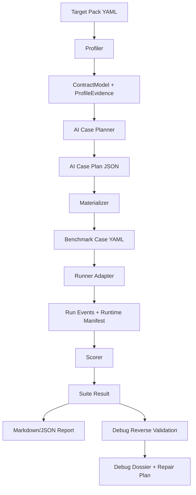

# Agent Workflow Benchmark

English | [简体中文](#agent-workflow-benchmark-简体中文)

Agent Workflow Benchmark is an AI-first benchmark toolkit for evaluating, comparing, and debugging agent workflows from Codex, Claude Code, and compatible command-line agent runtimes.

It is designed for workflow-level evaluation, not only prompt-level evaluation. The benchmark profiles a target workflow, asks an LLM runtime to externalize its understanding of that workflow, generates executable benchmark cases from the discovered contract, scores structured runner/simulated events, and produces explainable diagnostic score and debug artifacts.

The repository ships only generic fixtures by default. Any real directory, CLI, or hybrid agent workflow should be onboarded through a target pack owned by that workflow, not hard-coded into the reusable tool package.

## What It Evaluates

Agent Workflow Benchmark focuses on the declared workflow contract and the structured behavior evidence emitted by a runner or simulator:

- Workflow capability: routing, ownership, handoff, gates, joins, artifacts, state reads, and side-effect policy.
- Effectiveness: whether the structured run evidence shows the workflow produced the required evidence and avoided hard failures.
- Standardization: whether the workflow follows declared contracts instead of implicit or ad-hoc behavior.
- Explainability: every case, oracle, score cap, hard failure, and benchmark release/diagnostic decision is stored as structured evidence.
- Execution efficiency: wall-clock duration is captured per case and surfaced in the result model.
- Token consumption: input/output/total/wasted token fields are part of every case result. Current live runners mark token source confidence explicitly when native token usage is unavailable.
- Self-debug quality: overlay-only mutation reverse validation checks whether the benchmark scorer and oracles detect known bad workflow signals. It does not mutate the real target source or prove live-runner behavior.

## Capabilities

- **Generic target packs**: describe a workflow with entrypoints, roles, contracts, artifacts, budgets, and command policy under `configs/targets/`.
- **Contract profiling**: scan target role files, hash evidence, build a stable `ContractModel`, and preserve source excerpts for AI planning.
- **AI-generated cases**: `plan-cases` calls Codex or Claude to generate high-signal cases from the profiled contract and workflow evidence.
- **Case materialization**: `materialize --strategy ai` turns AI case drafts into executable YAML benchmark cases with stable hashes and oracle IDs.
- **Multiple runners**: supports `codex`, `claude`, `opencode`, and `simulated` capability detection. Live execution is currently implemented for Codex and Claude; `opencode` is modeled for runner compatibility.
- **Complete evaluation workflow**: `evaluate` runs profile, AI case planning, materialization, execution, scoring, reporting, recommendation generation, and P0 case persistence in one command.
- **Multi-dimensional scoring**: scoring includes raw score, capped score, verdict, hard failures, dimension scores, telemetry completeness, token fields, wall-clock efficiency, and score provenance.
- **Reports and recommendations**: `report` writes Markdown and JSON artifacts with dimension summaries, top risks, agent modification recommendations, and P0 case records.
- **Harness validation**: `evaluate` records whether the AI harness itself followed the required phases: target profiling, workflow understanding, case planning, materialization, execution, scoring, and recommendation generation.
- **P0 case persistence**: hard P0 failures are written to `p0-cases.json`, `p0-cases.md`, and optionally appended to a durable local JSONL log with `--p0-case-log`.
- **Self-debug workflow**: `debug prepare-env`, `debug reverse-validate`, `debug diagnose`, `debug propose-fix`, and `debug repair` help verify and improve the benchmark itself.
- **Plugin distribution**: ships both Codex and Claude Code plugin manifests plus a bundled runtime, so users can install the plugin without cloning the source repository.

## Install Without Cloning Source

The repository currently lives at:

```text
https://github.com/LAwLi3tCoding/agent-workflow-benchmark
```

The repository is private at the time of writing. Users must have access to the repository and working Git credentials for marketplace installation.

Prerequisites for plugin runtime execution:

- Node.js and npm available on the machine.
- Codex CLI or Claude Code installed, depending on the host you use.
- A reachable `codex` or `claude` executable for live benchmark execution. `opencode` is compatibility metadata/capability detection only in the current implementation. Simulated runs do not require live runners.

### Codex Plugin Install

Add the Git repository as a Codex plugin marketplace:

```bash
codex plugin marketplace add https://github.com/LAwLi3tCoding/agent-workflow-benchmark --ref main
```

Install the plugin:

```bash
codex plugin add agent-workflow-benchmark@agent-workflow-benchmark
```

Optional sparse marketplace install, if you want Codex to fetch only marketplace and plugin files:

```bash
codex plugin marketplace add https://github.com/LAwLi3tCoding/agent-workflow-benchmark \
  --ref main \
  --sparse .agents/plugins \
  --sparse plugins/agent-workflow-benchmark
codex plugin add agent-workflow-benchmark@agent-workflow-benchmark
```

If sparse installation fails because of a Codex version or marketplace cache behavior, use the non-sparse command above.

After installation, ask Codex to use the `agent-workflow-benchmark` skill or run the plugin wrapper from the installed plugin cache. The skill is written to resolve the wrapper from the plugin directory when `awb` is not already on `PATH`.

### Claude Code Plugin Install

Claude Code plugin marketplaces are managed inside Claude Code with slash commands. Add this repository as a marketplace:

```shell
/plugin marketplace add LAwLi3tCoding/agent-workflow-benchmark
```

If your Claude Code setup requires a full Git URL for private repositories, use:

```shell
/plugin marketplace add https://github.com/LAwLi3tCoding/agent-workflow-benchmark.git
```

Install the plugin:

```shell
/plugin install agent-workflow-benchmark@agent-workflow-benchmark
/reload-plugins
```

Claude Code also supports direct shell plugin management after the marketplace is configured:

```bash
claude plugin install agent-workflow-benchmark@agent-workflow-benchmark --scope user
```

Claude Code adds a plugin's `bin/` directory to the Bash tool `PATH` while the plugin is enabled, so `awb` should be available inside Claude Code after reload.

Reference:

- Claude Code plugin installation: https://code.claude.com/docs/en/discover-plugins
- Claude Code plugin structure: https://code.claude.com/docs/en/plugins
- Claude Code marketplace format: https://code.claude.com/docs/en/plugin-marketplaces

### Why No Source Checkout Is Required

The plugin package includes:

- `.codex-plugin/plugin.json`
- `.claude-plugin/plugin.json`
- `skills/agent-workflow-benchmark/SKILL.md`
- `commands/agent-workflow-benchmark.md`
- `bin/awb`
- `runtime/dist/` compiled JavaScript CLI
- `runtime/configs/`, `runtime/schemas/`, and `runtime/fixtures/`
- `runtime/package.json` and `runtime/package-lock.json`

On first use, `bin/awb` installs runtime dependencies inside the plugin cache with `npm ci --omit=dev` and then executes:

```bash
node runtime/dist/src/cli/index.js
```

For source development, set `AWB_PROJECT_ROOT=/path/to/agent-workflow-benchmark` to force the wrapper to run the TypeScript source checkout instead of the bundled runtime.

## Quick Start

Validate the installed runtime:

```bash
awb validate-schema
```

Run a simulated AI-first flow with fixture-generated cases:

```bash
awb evaluate \
  --target minimal-directory-agent \
  --planner-runner fixture \
  --runner simulated \
  --coverage-mode smoke \
  --out reports/evaluations/minimal-directory-agent-fixture
```

The one-shot `evaluate` command writes profile artifacts, an AI case plan, materialized cases, a run result, `report.md`, `harness-validation.json`, `recommendations.json`, `recommendations.md`, P0 case artifacts, and `evaluation-summary.json`.

If you need to inspect or replace an intermediate artifact, run the same flow step by step:

```bash
awb plan-cases \
  --target minimal-directory-agent \
  --runner fixture \
  --max-cases 3 \
  --out reports/ai-plans/minimal-directory-agent

awb materialize \
  --target minimal-directory-agent \
  --suite smoke \
  --strategy ai \
  --ai-plan reports/ai-plans/minimal-directory-agent/ai-case-plan.json \
  --out cases/generated/minimal-directory-agent/ai-smoke

awb run \
  --cases-dir cases/generated/minimal-directory-agent/ai-smoke \
  --runner simulated \
  --execution simulated \
  --mode diagnostic \
  --out reports/runs/minimal-directory-agent-ai

awb report --run reports/runs/minimal-directory-agent-ai --format md,json
awb score --run reports/runs/minimal-directory-agent-ai
```

Run a live Codex AI planner and live Codex case execution:

```bash
awb plan-cases \
  --target minimal-directory-agent \
  --runner codex \
  --max-cases 3 \
  --out reports/ai-plans/minimal-directory-agent-codex

awb materialize \
  --target minimal-directory-agent \
  --strategy ai \
  --ai-plan reports/ai-plans/minimal-directory-agent-codex/ai-case-plan.json \
  --out cases/generated/minimal-directory-agent/codex-ai-smoke

awb run \
  --cases-dir cases/generated/minimal-directory-agent/codex-ai-smoke \
  --runner codex \
  --execution live \
  --mode diagnostic \
  --out reports/runs/minimal-directory-agent-codex-live
```

Use Claude instead of Codex:

```bash
awb plan-cases --target minimal-directory-agent --runner claude --max-cases 3 --out reports/ai-plans/minimal-directory-agent-claude
awb materialize --target minimal-directory-agent --strategy ai --ai-plan reports/ai-plans/minimal-directory-agent-claude/ai-case-plan.json --out cases/generated/minimal-directory-agent/claude-ai-smoke
awb run --cases-dir cases/generated/minimal-directory-agent/claude-ai-smoke --runner claude --execution live --out reports/runs/minimal-directory-agent-claude-live
```

## Main Commands

```bash
awb validate-schema
```

Validates JSON schemas, runner configs, and registered target packs.

```bash
awb profile --target <target-id> --out <dir>
```

Builds `profile-evidence.json`, `contract-model.json`, and `profile-summary.json`.

```bash
awb evaluate --target <target-id> --planner-runner codex|claude|fixture --runner codex|claude|simulated --coverage-mode smoke|full|adaptive --execution simulated|live --out <dir>
```

Runs the complete benchmark workflow: profile, AI plan, materialize, run, score, report, `harness-validation.json`, `recommendations.json/md`, P0 records, and `evaluation-summary.json`.

Live execution is currently implemented for `codex` and `claude`. Use `simulated` for deterministic local scorer/oracle checks; `opencode` is modeled for capability detection and compatibility metadata only.

```bash
awb plan-cases --target <target-id> --runner codex|claude|fixture --max-cases <n> --out <dir>
```

Generates `ai-case-planner-prompt.txt`, `ai-case-planner-response.json`, and `ai-case-plan.json`.

```bash
awb materialize --target <target-id> --suite smoke --strategy template|ai --ai-plan <path> --out <dir>
```

Writes case YAML files, `manifest.json`, and `template-applicability.json`.

```bash
awb run --cases-dir <dir> --runner codex|claude|simulated --execution simulated|live --out <dir> [--p0-case-log <jsonl>]
```

Runs all materialized cases and writes events, case results, `suite-result.json`, `runtime-manifest.json`, `recommendations.json`, `recommendations.md`, `p0-cases.json`, and `p0-cases.md`. Use `--mutation <mutation-yaml>` with simulated execution to inject a known failure and validate P0 recording.

```bash
awb score --run <dir>
awb report --run <dir> --format md,json
```

Prints the benchmark release/diagnostic decision and score, then renders Markdown/JSON report artifacts.

## Self-Debug and Reverse Validation

The benchmark can simulate target workflow or evaluation-condition regressions through overlay-only fixtures and verify whether the benchmark catches them.

Prepare a reproducible debug environment:

```bash
awb debug prepare-env \
  --target <target-id> \
  --suite smoke \
  --runner codex \
  --mock-profile strict \
  --out .benchmark-debug/<target-id>-env
```

Run overlay-only mutation reverse validation for benchmark self-debug. This path intentionally uses the simulated runner; it is not a Codex/Claude live-runner validation.

```bash
awb debug reverse-validate \
  --target <target-id> \
  --suite smoke \
  --mutation-set fixtures/mutations/extended.yaml \
  --runner simulated \
  --suite-result reports/runs/<target-id>-ai/suite-result.json \
  --out .benchmark-debug/<target-id>-mutations
```

Diagnose gaps and propose benchmark-side repair:

```bash
awb debug diagnose \
  --debug-run .benchmark-debug/<target-id>-mutations \
  --out .benchmark-debug/<target-id>-mutations/diagnosis

awb debug propose-fix \
  --dossier .benchmark-debug/<target-id>-mutations/diagnosis/debug-dossier.json \
  --out .benchmark-debug/<target-id>-mutations/diagnosis/repair-plan.md

awb debug repair \
  --dossier .benchmark-debug/<target-id>-mutations/diagnosis/debug-dossier.json
```

Debug result fields are intentionally separate from the target score. They measure benchmark scorer/oracle health for overlay-only mutations, including mutation kill rate, false negatives, false positives, and reproducibility.

## Target Pack Model

A target pack lives under `configs/targets/<target-id>.yaml` and is registered in `configs/targets/registry.yaml`.

For a new directory-style agent workflow, generate a reviewable draft from existing agent files:

```bash
awb init-target \
  --agent-root /absolute/path/to/workflow \
  --target-id my-agent-workflow \
  --name "My Agent Workflow" \
  --out configs/targets/my-agent-workflow.draft.yaml
```

The command also writes a `.gaps.md` review file. Treat the generated YAML as a draft: workflow owners should confirm inferred roles, owner scopes, joins, artifacts, forbidden routes, budgets, and command policy before moving it to `configs/targets/<target-id>.yaml` and registering it.

It declares:

- `id`, `name`, and `targetType`: `directory`, `cli`, or `hybrid`.
- `root`: target workflow root directory.
- `entrypoints`: files or commands that represent how the workflow is invoked.
- `roles`: agent role files and ownership scopes.
- `contracts.statuses`: valid workflow terminal or gate statuses.
- `contracts.requiredOwners`: ownership rules for critical scopes.
- `contracts.routing.forbidden`: routing paths that must never occur.
- `contracts.joins`: required producer/consumer callback or join relationships.
- `contracts.artifacts`: required output paths and owners.
- `contracts.states`: state files the workflow may read or write.
- `contracts.budgets`: wall-clock and token budgets.
- `commandPolicy`: allowed executables and forbidden arguments.

Minimal example:

```yaml
schemaVersion: 0.1.0
id: my-agent-workflow
name: My Agent Workflow
targetType: directory
root: /absolute/path/to/workflow
entrypoints:
  - id: main
    kind: file
    path: AGENTS.md
roles:
  - id: planner
    path: planner/CLAUDE.md
    ownerScopes: ["planning"]
contracts:
  statuses: ["PASS", "FAIL", "NEEDS_USER"]
  requiredOwners:
    planning: planner
  routing:
    forbidden: []
  joins: []
  artifacts:
    - id: plan
      path: deliverables/plan.md
      owner: planner
  states: []
  budgets:
    wallClockSeconds: 600
    tokenTotal: 120000
commandPolicy:
  allowedExecutables: ["codex", "claude", "git", "rg"]
  forbiddenArgs: ["--prod", "--force"]
```

Then add the target ID to `configs/targets/registry.yaml`.

## Architecture



### Components

- `src/core/targetRegistry.ts`: loads and validates target registry entries.
- `src/profiler/profileTarget.ts`: scans workflow files, captures excerpts, and builds the stable `ContractModel`.
- `src/generator/aiPlanner.ts`: builds the LLM planning prompt and invokes Codex, Claude, or fixture planning.
- `src/generator/coverage.ts`: derives workflow coverage targets and validates AI case plans against the `ContractModel`.
- `src/generator/materialize.ts`: converts templates or AI plans into executable benchmark case YAML.
- `src/runner/runnerCapabilities.ts`: detects runner executables, versions, token source confidence, and comparability.
- `src/runner/liveCodexRunner.ts`: implements Codex and Claude live runner execution.
- `src/runner/simulatedRunner.ts`: deterministic local runner for smoke tests and development.
- `src/scorer/score.ts`: converts events to case and suite scores with hard-failure caps and provenance.
- `src/report/report.ts`: renders readable Markdown report output.
- `src/debug/debugWorkflow.ts`: prepares mock/debug environments and mutation reverse validation artifacts.
- `plugins/agent-workflow-benchmark/`: Codex and Claude Code plugin package.
- `scripts/build-plugin-runtime.mjs`: creates the self-contained plugin runtime.

## How AI Is Used

AI is used in the case planning stage and optionally in live case execution.

During `plan-cases`:

1. The profiler scans the target workflow role files and extracts up to 4000 bytes from each scanned file.
2. The profiler builds a stable `ContractModel` containing roles, owners, routing constraints, joins, artifacts, states, budgets, and command policy.
3. The planner derives coverage targets from that contract, including roles, owner scopes, joins, forbidden routes, artifacts, states, statuses, and command policy.
4. The planner prompt asks the selected LLM runtime to understand the target workflow before generating cases.
5. The LLM returns JSON with `targetUnderstanding`, `workflowUnderstanding`, `coverageTags`, `scoringRubric`, and a bounded list of case drafts.
6. The tool normalizes the returned JSON and writes `ai-case-plan-validation.json` before materialization. Materialization rejects invalid role, join, or artifact bindings.

`smoke` mode keeps the recommended case count at 32 or lower for fast feedback. `full` and `adaptive` modes can recommend more than 32 cases when the ContractModel has a larger workflow surface. `--max-cases` is only a per-pass budget override.

Runner behavior:

- `--runner codex` uses `codex exec` for planning or live execution.
- `--runner claude` uses `claude -p` for planning or live execution.
- `--runner fixture` uses deterministic built-in case plans for tests.
- `--runner simulated` uses deterministic local events and does not call an external LLM.

Environment overrides:

```bash
AWB_CODEX_EXECUTABLE=/path/to/codex
AWB_CLAUDE_EXECUTABLE=/path/to/claude
AWB_OPENCODE_EXECUTABLE=/path/to/opencode
AWB_CODEX_MODEL=gpt-5.3-codex-spark
```

## Scoring and Explainability

Scoring is deterministic over structured run events first. Current live adapters depend on runner-reported structured results such as `hardFailureCodes`; they do not independently observe real target entrypoint execution, filesystem changes, or tool traces. AI judgment may contribute semantic workflow-quality evidence, but it must not override deterministic scoring of hard-failure events, runner availability, or telemetry completeness.

Each case result includes:

- `score`, `rawScore`, `cappedScore`, and `scoreCap`.
- `verdict`: `PASS`, `PASS_WITH_WARNINGS`, `FAIL`, or `DIAGNOSTIC_ONLY`.
- `hardFailures`: contract violations such as owner bypass, false PASS gate, artifact path drift, missing join, forbidden route, or production side effect.
- `telemetryCompleteness`: whether the run generated enough structured evidence.
- `tokens`: input, output, total, wasted, and confidence.
- `efficiency.wallClockSeconds`: per-case execution duration.
- `evaluationDimensions`: per-case contract, routing, ownership, gate, artifact, join, side-effect, telemetry, efficiency, and runner scoring details.
- `scoreProvenance`: oracle and dimension explanations.
- `runner.comparability`: whether workflow score, efficiency, and token cost are comparable, directional only, or not comparable.

Suite output includes:

- `rawSuiteScore`
- `cappedSuiteScore`
- `releaseDecision`: `APPROVE`, `CONDITIONAL_APPROVE`, `BLOCK`, or `DIAGNOSTIC_ONLY` for the benchmark evidence that was actually collected.
- `releaseRuleId`
- `dimensionScores`: suite-level rollup for each evaluation dimension.
- `recommendations`: prioritized agent workflow modification suggestions with evidence case IDs and failure codes.
- `p0CaseRecords`: local record entries for every P0 hard-failure case.
- `debugHealth`

The result is intentionally explainable: a low score should show which hard failure or telemetry gap caused it, and whether token/efficiency numbers are comparable or only directional.

## Development From Source

Clone and validate:

```bash
git clone https://github.com/LAwLi3tCoding/agent-workflow-benchmark.git
cd agent-workflow-benchmark
npm install
npm run validate
```

Run the CLI from source:

```bash
npm run benchmark -- validate-schema
npm run benchmark -- profile --target minimal-directory-agent --out reports/profile/minimal-directory-agent
```

Build the self-contained plugin runtime:

```bash
npm run plugin:build
```

Validate the plugin package:

```bash
npm test -- tests/plugin-package.test.ts
plugins/agent-workflow-benchmark/bin/awb validate-schema
```

The generated runtime is stored in `plugins/agent-workflow-benchmark/runtime/` and is committed so marketplace installs can run without a source checkout.

## Repository Layout

```text
.
├── .agents/plugins/marketplace.json          # Codex marketplace catalog
├── .claude-plugin/marketplace.json           # Claude Code marketplace catalog
├── configs/
│   ├── runners/                              # runner config files
│   └── targets/                              # target pack registry and target YAML
├── fixtures/
│   ├── mutations/                            # reverse-validation mutation sets
│   └── repos/                                # fixture target workflows
├── plugins/agent-workflow-benchmark/
│   ├── .codex-plugin/plugin.json
│   ├── .claude-plugin/plugin.json
│   ├── bin/awb
│   ├── commands/
│   ├── runtime/                              # bundled no-source runtime
│   └── skills/
├── schemas/                                  # JSON schemas
├── scripts/build-plugin-runtime.mjs
├── src/                                      # TypeScript CLI implementation
└── tests/                                    # Vitest tests
```

## Current Boundaries

- Token metrics are structurally supported. Current live Codex/Claude adapters mark token usage as unavailable when the runner does not expose native token usage in the captured output.
- Efficiency is measured as wall-clock seconds per case. Cross-runner comparability is marked explicitly.
- `opencode` is present in runner capability detection and config, but live execution currently routes through Codex and Claude adapters.
- Live runner prompts are read-only and diagnostic by design; they inspect prompt summaries and runner output, and should not modify target files or call production services. They are not yet real target entrypoint observers unless a target adapter emits workflow trace events.
- The plugin runtime installs npm dependencies on first use inside the plugin cache. This is separate from cloning the source repository.

## Related Documentation

- [Human guide](docs/agent-workflow-benchmark-human-guide.md)
- [Plugin guide](docs/agent-workflow-benchmark-plugin-guide.md)

---

# Agent Workflow Benchmark 简体中文

[English](#agent-workflow-benchmark) | 简体中文

Agent Workflow Benchmark 是一个 AI-first 的 agent workflow 通用测评工具，用于在 Codex、Claude Code 以及兼容的命令行 agent runtime 中评测、对比和调试 agent 工作流。

它评测的是 workflow 级能力，而不只是单个 prompt。工具会先画像目标 workflow，让当前 LLM runtime 外显它对该 workflow 的结构化理解，再基于抽取出的契约动态生成可执行测评用例，随后对 runner/simulator 产生的结构化事件评分，并输出可解释的诊断报告和 debug 证据。

仓库默认只随包发布通用 fixture。真实目录型、CLI 型或混合型 agent workflow 应该由该 workflow 自己提供 target pack，不应硬编码进可复用工具包。

## 测评什么

Agent Workflow Benchmark 关注声明式 workflow 契约，以及 runner 或 simulator 输出的结构化行为证据：

- Workflow 能力：路由、owner、handoff、gate、join、artifact、state read、side-effect policy。
- 有效性：结构化运行证据是否表明 workflow 产出了所需证据，并避免硬失败。
- 标准程度：workflow 是否遵守声明式契约，而不是依赖隐式或临时约定。
- 可解释性：每个 case、oracle、分数上限、硬失败和 benchmark 发布/诊断决策都有结构化证据。
- 执行效率：每个 case 记录 wall-clock duration，并进入结果模型。
- Token 消耗：每个 case result 都包含 input/output/total/wasted token 字段。当前 live runner 无法获得原生 token 时会显式标记 token source confidence。
- 自身 debug 能力：overlay-only mutation reverse validation 会检查 benchmark scorer/oracle 能否发现已知坏信号；它不会修改真实 target 源码，也不证明 live runner 行为。

## 能力概览

- **通用 target pack**：在 `configs/targets/` 下声明 workflow 的 entrypoint、role、contract、artifact、budget 和 command policy。
- **契约画像**：扫描目标 role 文件、计算 hash、生成稳定的 `ContractModel`，并保留代码/文档片段供 AI planner 使用。
- **AI 生成用例**：`plan-cases` 调用 Codex 或 Claude，基于目标契约和证据生成高信号测评 case。
- **用例物化**：`materialize --strategy ai` 将 AI case draft 转成稳定 hash 的 YAML 测评用例。
- **多 runner 支持**：支持 `codex`、`claude`、`opencode`、`simulated` 的能力检测。当前 live execution 已实现 Codex 和 Claude；`opencode` 处于 runner 兼容建模状态。
- **完整评估 workflow**：`evaluate` 一次完成 profile、AI case plan、materialize、run、score、report、修改建议和 P0 case 落盘。
- **多维度可解释评分**：评分包含 raw score、capped score、verdict、hard failure、dimension scores、telemetry completeness、token 字段、wall-clock efficiency 和 score provenance。
- **报告与修改建议**：`report` 在 run 目录下生成包含维度汇总、top risks、agent 修改建议和 P0 case records 的 Markdown/JSON 结果。
- **Harness validation**：`evaluate` 会记录 AI harness 是否按 target profiling、workflow understanding、case planning、materialization、execution、scoring、recommendation generation 的规范执行。
- **P0 case 持久化**：P0 hard failure 会写入 `p0-cases.json`、`p0-cases.md`，也可通过 `--p0-case-log` 追加到本地 JSONL 日志。
- **自身 debug workflow**：`debug prepare-env`、`debug reverse-validate`、`debug diagnose`、`debug propose-fix`、`debug repair` 用于验证和优化 benchmark 自身。
- **插件分发**：同时提供 Codex 和 Claude Code 插件 manifest，并内置 runtime，因此用户不需要 clone 源码也可以安装使用。

## 不下载源码安装插件

当前仓库地址：

```text
https://github.com/LAwLi3tCoding/agent-workflow-benchmark
```

当前仓库是 private。安装者需要拥有该 GitHub 仓库访问权限，并且本机 Git 凭证可用。

插件 runtime 运行前提：

- 本机有 Node.js 和 npm。
- 根据使用场景安装 Codex CLI 或 Claude Code。
- live benchmark 需要本机有可执行的 `codex` 或 `claude`。当前 `opencode` 仅用于兼容性元数据和能力检测。simulated run 不需要 live runner。

### Codex 插件安装

添加 Git 仓库作为 Codex plugin marketplace：

```bash
codex plugin marketplace add https://github.com/LAwLi3tCoding/agent-workflow-benchmark --ref main
```

安装插件：

```bash
codex plugin add agent-workflow-benchmark@agent-workflow-benchmark
```

如果希望 Codex 只拉取 marketplace 和插件目录，可以使用 sparse 安装：

```bash
codex plugin marketplace add https://github.com/LAwLi3tCoding/agent-workflow-benchmark \
  --ref main \
  --sparse .agents/plugins \
  --sparse plugins/agent-workflow-benchmark
codex plugin add agent-workflow-benchmark@agent-workflow-benchmark
```

如果 sparse 安装因 Codex 版本或 marketplace cache 行为失败，使用上面的非 sparse 命令即可。

安装完成后，在 Codex 中使用 `agent-workflow-benchmark` skill，或从已安装插件 cache 中运行插件 wrapper。skill 会在 `awb` 不在 `PATH` 时，从插件目录解析 wrapper。

### Claude Code 插件安装

Claude Code 的 plugin marketplace 通过 Claude Code 内的 slash command 管理。添加该仓库作为 marketplace：

```shell
/plugin marketplace add LAwLi3tCoding/agent-workflow-benchmark
```

如果你的 Claude Code 环境访问 private repo 时需要完整 Git URL：

```shell
/plugin marketplace add https://github.com/LAwLi3tCoding/agent-workflow-benchmark.git
```

安装插件：

```shell
/plugin install agent-workflow-benchmark@agent-workflow-benchmark
/reload-plugins
```

marketplace 配置完成后，也可以用 Claude Code shell 命令安装：

```bash
claude plugin install agent-workflow-benchmark@agent-workflow-benchmark --scope user
```

Claude Code 在插件启用时会把插件的 `bin/` 目录加入 Bash tool 的 `PATH`，因此 reload 后 Claude Code 内应可直接使用 `awb`。

参考：

- Claude Code 插件安装：https://code.claude.com/docs/en/discover-plugins
- Claude Code 插件结构：https://code.claude.com/docs/en/plugins
- Claude Code marketplace 格式：https://code.claude.com/docs/en/plugin-marketplaces

### 为什么不需要源码

插件包内置以下内容：

- `.codex-plugin/plugin.json`
- `.claude-plugin/plugin.json`
- `skills/agent-workflow-benchmark/SKILL.md`
- `commands/agent-workflow-benchmark.md`
- `bin/awb`
- `runtime/dist/` 编译后的 JavaScript CLI
- `runtime/configs/`、`runtime/schemas/`、`runtime/fixtures/`
- `runtime/package.json` 和 `runtime/package-lock.json`

首次使用时，`bin/awb` 会在插件 cache 内执行 `npm ci --omit=dev` 安装 runtime 依赖，然后执行：

```bash
node runtime/dist/src/cli/index.js
```

如果是源码开发，可以设置 `AWB_PROJECT_ROOT=/path/to/agent-workflow-benchmark`，强制 wrapper 使用源码目录中的 TypeScript 实现，而不是插件内置 runtime。

## 快速开始

验证已安装 runtime：

```bash
awb validate-schema
```

使用 fixture planner 跑一个 simulated AI-first 流程：

```bash
awb evaluate \
  --target minimal-directory-agent \
  --planner-runner fixture \
  --runner simulated \
  --coverage-mode smoke \
  --out reports/evaluations/minimal-directory-agent-fixture
```

一键 `evaluate` 会写出 profile、AI case plan、物化 case、run result、`report.md`、`harness-validation.json`、`recommendations.json`、`recommendations.md`、P0 case artifacts 和 `evaluation-summary.json`。

如果需要检查或替换中间产物，可以按步骤执行同一流程：

```bash
awb plan-cases \
  --target minimal-directory-agent \
  --runner fixture \
  --max-cases 3 \
  --out reports/ai-plans/minimal-directory-agent

awb materialize \
  --target minimal-directory-agent \
  --suite smoke \
  --strategy ai \
  --ai-plan reports/ai-plans/minimal-directory-agent/ai-case-plan.json \
  --out cases/generated/minimal-directory-agent/ai-smoke

awb run \
  --cases-dir cases/generated/minimal-directory-agent/ai-smoke \
  --runner simulated \
  --execution simulated \
  --mode diagnostic \
  --out reports/runs/minimal-directory-agent-ai

awb report --run reports/runs/minimal-directory-agent-ai --format md,json
awb score --run reports/runs/minimal-directory-agent-ai
```

使用 Codex 做 AI planner 和 live case execution：

```bash
awb plan-cases \
  --target minimal-directory-agent \
  --runner codex \
  --max-cases 3 \
  --out reports/ai-plans/minimal-directory-agent-codex

awb materialize \
  --target minimal-directory-agent \
  --strategy ai \
  --ai-plan reports/ai-plans/minimal-directory-agent-codex/ai-case-plan.json \
  --out cases/generated/minimal-directory-agent/codex-ai-smoke

awb run \
  --cases-dir cases/generated/minimal-directory-agent/codex-ai-smoke \
  --runner codex \
  --execution live \
  --mode diagnostic \
  --out reports/runs/minimal-directory-agent-codex-live
```

使用 Claude：

```bash
awb plan-cases --target minimal-directory-agent --runner claude --max-cases 3 --out reports/ai-plans/minimal-directory-agent-claude
awb materialize --target minimal-directory-agent --strategy ai --ai-plan reports/ai-plans/minimal-directory-agent-claude/ai-case-plan.json --out cases/generated/minimal-directory-agent/claude-ai-smoke
awb run --cases-dir cases/generated/minimal-directory-agent/claude-ai-smoke --runner claude --execution live --out reports/runs/minimal-directory-agent-claude-live
```

## 主要命令

```bash
awb validate-schema
```

校验 JSON schema、runner config 和已注册 target pack。

```bash
awb profile --target <target-id> --out <dir>
```

生成 `profile-evidence.json`、`contract-model.json` 和 `profile-summary.json`。

```bash
awb evaluate --target <target-id> --planner-runner codex|claude|fixture --runner codex|claude|simulated --coverage-mode smoke|full|adaptive --execution simulated|live --out <dir>
```

执行完整 benchmark workflow：profile、AI plan、materialize、run、score、report、`harness-validation.json`、`recommendations.json/md`、P0 records 和 `evaluation-summary.json`。

当前 live execution 只实现了 `codex` 和 `claude`。`simulated` 用于本地确定性 scorer/oracle 检查；`opencode` 目前仅用于能力检测和兼容性元数据建模。

```bash
awb plan-cases --target <target-id> --runner codex|claude|fixture --max-cases <n> --out <dir>
```

生成 `ai-case-planner-prompt.txt`、`ai-case-planner-response.json` 和 `ai-case-plan.json`。

```bash
awb materialize --target <target-id> --suite smoke --strategy template|ai --ai-plan <path> --out <dir>
```

写出 case YAML、`manifest.json` 和 `template-applicability.json`。

```bash
awb run --cases-dir <dir> --runner codex|claude|simulated --execution simulated|live --out <dir> [--p0-case-log <jsonl>]
```

执行物化后的 case，并写出 events、case results、`suite-result.json`、`runtime-manifest.json`、`recommendations.json`、`recommendations.md`、`p0-cases.json` 和 `p0-cases.md`。可在 simulated execution 下用 `--mutation <mutation-yaml>` 注入已知失败，验证 P0 记录。

```bash
awb score --run <dir>
awb report --run <dir> --format md,json
```

打印 benchmark 发布/诊断决策和 score，并渲染 Markdown/JSON 报告。

## 自身 Debug 和反向验证

benchmark 可以通过 overlay-only fixture 模拟目标 workflow 或评测条件的回归，并验证测评工具是否能发现这个回归。

准备可复现 debug 环境：

```bash
awb debug prepare-env \
  --target <target-id> \
  --suite smoke \
  --runner codex \
  --mock-profile strict \
  --out .benchmark-debug/<target-id>-env
```

执行 overlay-only mutation reverse validation 作为 benchmark 自调试。该路径必须使用 simulated runner，不是 Codex/Claude live runner 验证。

```bash
awb debug reverse-validate \
  --target <target-id> \
  --suite smoke \
  --mutation-set fixtures/mutations/extended.yaml \
  --runner simulated \
  --suite-result reports/runs/<target-id>-ai/suite-result.json \
  --out .benchmark-debug/<target-id>-mutations
```

诊断 gap 并提出 benchmark-side repair：

```bash
awb debug diagnose \
  --debug-run .benchmark-debug/<target-id>-mutations \
  --out .benchmark-debug/<target-id>-mutations/diagnosis

awb debug propose-fix \
  --dossier .benchmark-debug/<target-id>-mutations/diagnosis/debug-dossier.json \
  --out .benchmark-debug/<target-id>-mutations/diagnosis/repair-plan.md

awb debug repair \
  --dossier .benchmark-debug/<target-id>-mutations/diagnosis/debug-dossier.json
```

debug result 和 target score 是分离的。debug 结果衡量 overlay-only mutation 下的 benchmark scorer/oracle 健康度，包括 mutation kill rate、false negative、false positive 和可复现性。

## Target Pack 模型

target pack 位于 `configs/targets/<target-id>.yaml`，并注册到 `configs/targets/registry.yaml`。

接入新的目录型 agent workflow 时，可以先从已有 agent 文件生成一个待审阅 draft：

```bash
awb init-target \
  --agent-root /absolute/path/to/workflow \
  --target-id my-agent-workflow \
  --name "My Agent Workflow" \
  --out configs/targets/my-agent-workflow.draft.yaml
```

该命令也会写出 `.gaps.md` 审阅文件。生成的 YAML 只是 draft：workflow owner 需要确认 role、owner scope、join、artifact、forbidden route、budget 和 command policy 后，再移动到 `configs/targets/<target-id>.yaml` 并注册。

它声明：

- `id`、`name`、`targetType`：`directory`、`cli` 或 `hybrid`。
- `root`：目标 workflow 根目录。
- `entrypoints`：workflow 调用入口，可以是文件或命令。
- `roles`：agent role 文件和 owner scope。
- `contracts.statuses`：合法 workflow 终态或 gate 状态。
- `contracts.requiredOwners`：关键 scope 的 owner 规则。
- `contracts.routing.forbidden`：禁止出现的路由路径。
- `contracts.joins`：必须出现的 producer/consumer callback 或 join 关系。
- `contracts.artifacts`：必要产物路径及 owner。
- `contracts.states`：workflow 可读写的状态文件。
- `contracts.budgets`：wall-clock 和 token 预算。
- `commandPolicy`：允许的 executable 和禁止参数。

最小示例：

```yaml
schemaVersion: 0.1.0
id: my-agent-workflow
name: My Agent Workflow
targetType: directory
root: /absolute/path/to/workflow
entrypoints:
  - id: main
    kind: file
    path: AGENTS.md
roles:
  - id: planner
    path: planner/CLAUDE.md
    ownerScopes: ["planning"]
contracts:
  statuses: ["PASS", "FAIL", "NEEDS_USER"]
  requiredOwners:
    planning: planner
  routing:
    forbidden: []
  joins: []
  artifacts:
    - id: plan
      path: deliverables/plan.md
      owner: planner
  states: []
  budgets:
    wallClockSeconds: 600
    tokenTotal: 120000
commandPolicy:
  allowedExecutables: ["codex", "claude", "git", "rg"]
  forbiddenArgs: ["--prod", "--force"]
```

然后把 target ID 加到 `configs/targets/registry.yaml`。

## 架构


### 组件

- `src/core/targetRegistry.ts`：加载并校验 target registry。
- `src/profiler/profileTarget.ts`：扫描 workflow 文件、截取证据、生成稳定的 `ContractModel`。
- `src/generator/aiPlanner.ts`：构造 LLM planning prompt，并调用 Codex、Claude 或 fixture planner。
- `src/generator/coverage.ts`：从 `ContractModel` 派生 workflow 覆盖目标，并校验 AI case plan。
- `src/generator/materialize.ts`：把 template 或 AI plan 转成可执行 benchmark case YAML。
- `src/runner/runnerCapabilities.ts`：检测 runner executable、版本、token source confidence 和可比较性。
- `src/runner/liveCodexRunner.ts`：实现 Codex 和 Claude live runner。
- `src/runner/simulatedRunner.ts`：为 smoke test 和开发提供确定性的本地 runner。
- `src/scorer/score.ts`：基于事件生成 case/suite score、硬失败 cap 和解释证据。
- `src/report/report.ts`：渲染可读 Markdown 报告。
- `src/debug/debugWorkflow.ts`：准备 mock/debug 环境并执行 mutation reverse validation。
- `plugins/agent-workflow-benchmark/`：Codex 和 Claude Code 插件包。
- `scripts/build-plugin-runtime.mjs`：生成自包含插件 runtime。

## AI 如何参与

AI 用在 case planning 阶段，并可选用于 live case execution。

执行 `plan-cases` 时：

1. profiler 扫描目标 workflow role 文件，并从每个文件提取最多 4000 bytes 证据片段。
2. profiler 构建稳定的 `ContractModel`，包含 role、owner、routing constraint、join、artifact、state、budget、command policy。
3. planner 从 contract 派生 coverage targets，包括 role、owner scope、join、forbidden route、artifact、state、status 和 command policy。
4. planner prompt 要求选定 LLM runtime 先理解目标 workflow，再生成测评 case。
5. LLM 返回 JSON，包含 `targetUnderstanding`、`workflowUnderstanding`、`coverageTags`、`scoringRubric` 和受数量限制的 case draft。
6. 工具会 normalize 返回 JSON，并写出 `ai-case-plan-validation.json`。materialize 会拒绝无效的 role、join 或 artifact binding。

`smoke` 模式会把推荐 case 数控制在 32 以内，用于快速反馈。`full` 和 `adaptive` 模式会根据 ContractModel 的 workflow 覆盖面推荐超过 32 的 case。`--max-cases` 只是单轮生成预算覆盖，不代表更少 case 一定足够。

runner 行为：

- `--runner codex` 使用 `codex exec` 做 planning 或 live execution。
- `--runner claude` 使用 `claude -p` 做 planning 或 live execution。
- `--runner fixture` 使用内置确定性 case plan，主要用于测试。
- `--runner simulated` 使用本地确定性事件，不调用外部 LLM。

环境变量覆盖：

```bash
AWB_CODEX_EXECUTABLE=/path/to/codex
AWB_CLAUDE_EXECUTABLE=/path/to/claude
AWB_OPENCODE_EXECUTABLE=/path/to/opencode
AWB_CODEX_MODEL=gpt-5.3-codex-spark
```

## 评分和可解释性

评分先对结构化运行事件做确定性评分。当前 live adapter 依赖 runner 返回的 `hardFailureCodes` 等结构化结果；它们还不会独立观察真实 target entrypoint 执行、文件系统变化或工具 trace。AI judgment 可以参与语义 workflow quality 证据，但不能覆盖 hard-failure 事件、runner 可用性或 telemetry completeness 的确定性评分。

每个 case result 包含：

- `score`、`rawScore`、`cappedScore`、`scoreCap`。
- `verdict`：`PASS`、`PASS_WITH_WARNINGS`、`FAIL`、`DIAGNOSTIC_ONLY`。
- `hardFailures`：owner bypass、false PASS gate、artifact path drift、missing join、forbidden route、production side effect 等契约违规。
- `telemetryCompleteness`：运行证据是否足够完整。
- `tokens`：input、output、total、wasted、confidence。
- `efficiency.wallClockSeconds`：case 执行耗时。
- `evaluationDimensions`：case 级 contract、routing、ownership、gate、artifact、join、side-effect、telemetry、efficiency、runner 多维评分明细。
- `scoreProvenance`：oracle 和评分维度解释。
- `runner.comparability`：workflow score、efficiency、token cost 是否可比较，还是只能方向性比较，或不可比较。

suite output 包含：

- `rawSuiteScore`
- `cappedSuiteScore`
- `releaseDecision`：`APPROVE`、`CONDITIONAL_APPROVE`、`BLOCK`、`DIAGNOSTIC_ONLY`，作用范围是本次 benchmark 实际收集到的证据。
- `releaseRuleId`
- `dimensionScores`：suite 级多维度评分汇总。
- `recommendations`：带证据 case 和 failure code 的 agent workflow 修改建议。
- `p0CaseRecords`：每个 P0 hard-failure case 的本地记录项。
- `debugHealth`

结果设计目标是可解释：低分需要能看到是哪个 hard failure 或 telemetry gap 导致的，也能看到 token/efficiency 数字到底是可比较还是仅方向性参考。

## 源码开发

clone 并验证：

```bash
git clone https://github.com/LAwLi3tCoding/agent-workflow-benchmark.git
cd agent-workflow-benchmark
npm install
npm run validate
```

从源码运行 CLI：

```bash
npm run benchmark -- validate-schema
npm run benchmark -- profile --target minimal-directory-agent --out reports/profile/minimal-directory-agent
```

构建自包含插件 runtime：

```bash
npm run plugin:build
```

验证插件包：

```bash
npm test -- tests/plugin-package.test.ts
plugins/agent-workflow-benchmark/bin/awb validate-schema
```

生成的 runtime 位于 `plugins/agent-workflow-benchmark/runtime/`，并会提交到仓库中，这样 marketplace 安装后无需源码 checkout 也能运行。

## 仓库结构

```text
.
├── .agents/plugins/marketplace.json          # Codex marketplace catalog
├── .claude-plugin/marketplace.json           # Claude Code marketplace catalog
├── configs/
│   ├── runners/                              # runner config files
│   └── targets/                              # target pack registry and target YAML
├── fixtures/
│   ├── mutations/                            # reverse-validation mutation sets
│   └── repos/                                # fixture target workflows
├── plugins/agent-workflow-benchmark/
│   ├── .codex-plugin/plugin.json
│   ├── .claude-plugin/plugin.json
│   ├── bin/awb
│   ├── commands/
│   ├── runtime/                              # bundled no-source runtime
│   └── skills/
├── schemas/                                  # JSON schemas
├── scripts/build-plugin-runtime.mjs
├── src/                                      # TypeScript CLI implementation
└── tests/                                    # Vitest tests
```

## 当前边界

- Token metrics 已在结构上支持。当前 Codex/Claude live adapter 在 runner 输出没有原生 token usage 时，会把 token usage 标记为 unavailable。
- Efficiency 使用每个 case 的 wall-clock seconds。跨 runner 的可比较性会显式标记。
- `opencode` 已进入 runner capability detection 和 config，但 live execution 当前由 Codex 和 Claude adapter 实现。
- live runner prompt 是 read-only diagnostic 设计，只检查 prompt 摘要和 runner 输出，不应修改目标文件或调用生产服务。除非后续 target adapter 产出 workflow trace events，否则它还不是实时 target entrypoint observer。
- 插件 runtime 首次运行时会在 plugin cache 内安装 npm 依赖。这不同于 clone 源码仓库。

## 相关文档

- [人读版方案](docs/agent-workflow-benchmark-human-guide.md)
- [插件使用说明](docs/agent-workflow-benchmark-plugin-guide.md)
