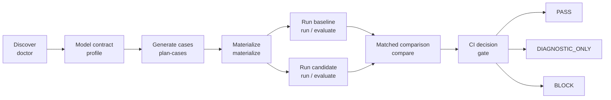
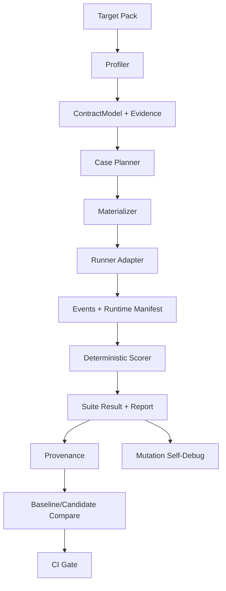

# Agent Workflow Bench

**CI-grade regression testing for coding-agent workflows.**

[English](README.md) · [简体中文](README.zh-CN.md) · [日本語](README.ja.md)

Agent Workflow Bench (AWB) discovers, evaluates, compares, and gates workflows
used by coding agents such as Codex and Claude Code. It tests the workflow
around the model—rules, skills, hooks, sub-agents, routing, handoffs, gates,
artifacts, state, budgets, and side-effect policies—not just the quality of a
single prompt or model response.

The product name is **Agent Workflow Bench**. The command-line interface remains
`awb`, and the package, plugin, and repository slug remains
`agent-workflow-benchmark` for compatibility.

> AWB is evidence-first. Deterministic contract violations and invalid
> provenance take precedence over aggregate scores and AI judgment. Evidence
> that is simulated, incomplete, or incomparable cannot produce a real CI PASS.

## Why AWB

Coding-agent workflows behave like software systems, but they are often changed
without software-grade regression evidence. A small edit to an instruction
file, skill, hook, routing rule, or sub-agent contract can silently change:

- which agent owns a task;
- whether required reviews and joins occur;
- whether a gate reports PASS honestly;
- where artifacts and state are written;
- which tools or side effects are allowed;
- how much time and context the workflow consumes;
- whether the workflow can recover after interruption.

AWB turns those expectations into a versioned target contract, generates or
materializes executable cases, captures traceable evidence, compares matched
baseline and candidate runs, and returns a deterministic release decision.

## Core Workflow



The recommended entry points are:

1. `awb doctor` — discover the target and state the runner/evidence ceiling.
2. `awb run` or `awb evaluate` — execute isolated baseline and candidate runs.
3. `awb compare` — compare matched evidence.
4. `awb gate` — produce a machine-readable and human-readable CI decision.

The existing profile, planning, materialization, scoring, reporting, P0, and
self-debug commands remain available for deeper control.

## What AWB Evaluates

| Area | Examples |
| --- | --- |
| Contract integrity | Entrypoints, roles, owners, statuses, required joins |
| Routing | Required routes, forbidden routes, callback ownership |
| Gates | False PASS, skipped mandatory checks, invalid terminal states |
| Artifacts and state | Missing files, wrong paths, invalid ownership, stale state |
| Side effects | Forbidden commands, external writes, production operations |
| Execution quality | Required evidence, task completion, recovery behavior |
| Efficiency | Wall-clock duration, retries, repeated work |
| Token usage | Input, output, total, wasted tokens, confidence |
| Explainability | Oracle IDs, score caps, hard failures, provenance |
| Harness quality | Mutation kill rate, false negatives, reproducibility |

## Feature Overview

| Command | Purpose | Main output |
| --- | --- | --- |
| `awb doctor` | Discover a target and inspect runner/evidence readiness | `doctor-result.json`, `doctor-report.md` |
| `awb init-target` | Generate a reviewable target-pack draft | Target YAML, gap report |
| `awb profile` | Build a stable workflow `ContractModel` | Profile evidence and contract JSON |
| `awb plan-cases` | Generate cases with Codex, Claude, or fixtures | AI plan and validation report |
| `awb materialize` | Turn plans/templates into executable case YAML | Cases, manifest, applicability matrix |
| `awb run` | Execute one case or a suite | Events, results, provenance, recommendations |
| `awb evaluate` | Run the complete evaluation pipeline | Profile, plan, cases, run, report, P0 records |
| `awb compare` | Compare baseline and candidate artifacts | Comparison JSON and Markdown |
| `awb gate` | Apply deterministic CI policy | Gate JSON and Markdown, stable exit code |
| `awb score` | Print the decision and score for an existing run | JSON summary |
| `awb report` | Render readable run reports | Markdown and JSON |
| `awb debug ...` | Validate and improve the benchmark harness | Dossier, repair plan, repair result |

Run `awb <command> --help` for the full option set.

## Evidence and Decision Model

### Comparison classifications

`awb compare` returns one of:

| Classification | Meaning |
| --- | --- |
| `IMPROVED` | Candidate evidence is better than the matched baseline |
| `REGRESSED` | Candidate introduced a measurable regression |
| `UNCHANGED` | No material change under the matched conditions |
| `MIXED` | Improvements and regressions coexist |
| `HARD_FAILURE` | A deterministic candidate failure dominates comparison |
| `INCOMPARABLE` | Conditions or provenance do not support a valid comparison |

### Paired CI gate

`awb gate` uses a separate three-state release contract:

| Decision | Exit code | Meaning |
| --- | ---: | --- |
| `PASS` | `0` | Trusted live `workflow_trace` evidence and no blocking regression |
| `DIAGNOSTIC_ONLY` | `2` | Evidence is simulated, incomplete, or incomparable |
| `BLOCK` | `1` | Hard failure, blocking regression, invalid provenance, or tool failure |

Hard failures always take precedence over score. Examples include forbidden
production effects, owner bypass, false PASS, forbidden routing, missing
required joins, critical artifact loss, and invalid provenance.

Each comparison bundles the baseline and candidate suite, provenance, and
runtime manifests under `evidence/`, records their hashes, and binds the
comparison payload to those snapshots. `awb gate` revalidates the bundle and
recomputes the comparison before applying release policy; an edited comparison
or evidence file is blocked by `GATE-COMPARISON-INTEGRITY`. Runtime execution
facts are also checked against provenance and the adapter's declared evidence
ceiling, so recomputing editable hashes cannot promote a simulated or
contract-summary run to `workflow_trace`.

The backward-compatible single-run `suite-result.json` retains
`APPROVE`, `CONDITIONAL_APPROVE`, `BLOCK`, and `DIAGNOSTIC_ONLY`. The paired CI
gate intentionally uses `PASS`, `DIAGNOSTIC_ONLY`, and `BLOCK`.

### Evidence levels

AWB records the evidence source and observation boundary explicitly:

- **Live workflow trace** — eligible for PASS when trusted and complete.
- **Live contract summary** — useful for diagnosis, but not enough for PASS.
- **Simulated events** — deterministic harness/scorer validation only.
- **Inferred evidence** — interpretation derived from recorded facts.
- **Unknown** — missing or unavailable observation.

Only trusted adapters that emit real `workflow_trace` events can produce a
paired CI PASS. Simulated runs and the current Codex/Claude
`contract-summary` adapters remain `DIAGNOSTIC_ONLY`, even when case scores are
high.

## Runner Support

| Runner | Planning | Case execution | Current evidence boundary |
| --- | --- | --- | --- |
| Codex | Live | Live adapter | Contract summary; diagnostic-only without workflow trace |
| Claude Code | Live | Live adapter | Contract summary; diagnostic-only without workflow trace |
| OpenCode | Capability detection | Adapter extension point | Capability-only |
| Simulated | Fixture plan | Deterministic local execution | Synthetic evidence; diagnostic-only |

Runner versions, executable capability, token confidence, execution mode, and
comparability are stored in provenance rather than assumed.

## Installation

### Requirements

- Node.js and npm; use a current LTS release.
- Codex or Claude Code for the corresponding live runner.
- Git access to the repository when installing from a private remote.

Simulated runs do not require a live coding-agent CLI.

Replace `GITHUB_OWNER` in the installation examples with the GitHub account or
organization that hosts your copy of the repository.

### Run from source

```bash
git clone https://github.com/GITHUB_OWNER/agent-workflow-benchmark.git
cd agent-workflow-benchmark
npm install
npm run validate
```

Run the TypeScript CLI:

```bash
npm run benchmark -- --help
npm run benchmark -- doctor \
  --target minimal-directory-agent \
  --runner simulated \
  --out reports/doctor
```

In the examples below, plugin users can run `awb ...`; source-checkout users
can replace it with `npm run benchmark -- ...`.

### Install as a Codex plugin

```bash
codex plugin marketplace add \
  https://github.com/GITHUB_OWNER/agent-workflow-benchmark \
  --ref main

codex plugin add \
  agent-workflow-benchmark@agent-workflow-benchmark
```

### Install as a Claude Code plugin

Inside Claude Code:

```text
/plugin marketplace add GITHUB_OWNER/agent-workflow-benchmark
/plugin install agent-workflow-benchmark@agent-workflow-benchmark
/reload-plugins
```

The plugin contains a bundled JavaScript runtime, schemas, configs, fixtures,
skills, and the `bin/awb` wrapper. A source checkout is not required after
installation. The wrapper installs production runtime dependencies inside the
plugin cache on first use.

## Quick Start: Safe Simulated Regression

This flow exercises discovery, baseline/candidate comparison, and the gate
without calling a live agent:

```bash
awb doctor \
  --target minimal-directory-agent \
  --runner simulated \
  --out reports/doctor

awb run \
  --target minimal-directory-agent \
  --runner simulated \
  --execution simulated \
  --out reports/regression/baseline

awb run \
  --target minimal-directory-agent \
  --runner simulated \
  --execution simulated \
  --out reports/regression/candidate

awb compare \
  --baseline reports/regression/baseline \
  --candidate reports/regression/candidate \
  --out reports/regression/comparison

awb gate \
  --comparison reports/regression/comparison/comparison-result.json \
  --out reports/regression/gate
```

The final command returns exit code `2` because simulated evidence is
diagnostic-only. This is the expected safe result.

## Matched Baseline/Candidate Regression

Use isolated checkouts and keep task, target contract, case set, runner,
execution mode, permissions, budget, and validation conditions aligned:

```bash
awb doctor \
  --target my-workflow \
  --target-root <baseline-checkout> \
  --runner codex \
  --out reports/doctor-baseline

awb run \
  --target my-workflow \
  --target-root <baseline-checkout> \
  --runner codex \
  --execution live \
  --mode diagnostic \
  --out reports/regression/baseline

awb run \
  --target my-workflow \
  --target-root <candidate-checkout> \
  --runner codex \
  --execution live \
  --mode diagnostic \
  --out reports/regression/candidate

awb compare \
  --baseline reports/regression/baseline \
  --candidate reports/regression/candidate \
  --out reports/regression/comparison

awb gate \
  --comparison reports/regression/comparison/comparison-result.json \
  --out reports/regression/gate
```

Use the same pattern with `--runner claude`. A custom adapter must emit trusted
workflow-trace evidence before the final gate can return PASS.

## One-Command Evaluation

`evaluate` preserves the existing AI-first pipeline and is useful for detailed
diagnosis, recommendations, and P0 persistence:

```bash
awb evaluate \
  --target my-workflow \
  --target-root <candidate-checkout> \
  --planner-runner codex \
  --runner codex \
  --coverage-mode full \
  --execution live \
  --out reports/evaluations/my-workflow
```

For deterministic local validation:

```bash
awb evaluate \
  --target minimal-directory-agent \
  --planner-runner fixture \
  --runner simulated \
  --coverage-mode smoke \
  --execution simulated \
  --out reports/evaluations/minimal-directory-agent
```

Coverage modes:

- `smoke` — bounded, fast feedback.
- `full` — broad contract coverage.
- `adaptive` — follow-up generation focused on missing coverage.

`--max-cases` limits a single planning pass; it does not prove full coverage.

## Onboard a Workflow

Generate a draft target pack:

```bash
awb init-target \
  --agent-root path/to/workflow \
  --target-id my-workflow \
  --name "My Workflow" \
  --target-type directory \
  --out configs/targets/my-workflow.draft.yaml
```

Review the generated gap report, then confirm:

- entrypoints and roles;
- owner scopes and required owners;
- statuses and GatePolicy;
- required joins and callbacks;
- artifacts and state paths;
- forbidden routes;
- wall-clock and token budgets;
- allowed commands and forbidden arguments.

Move the reviewed file to `configs/targets/my-workflow.yaml` and register it in
`configs/targets/registry.yaml`. Generated drafts are not trusted contracts
until a workflow owner reviews them.

Target types:

- `directory` — instructions, skills, hooks, and state in a directory tree;
- `cli` — a command-driven workflow;
- `hybrid` — directory contract plus executable entrypoints.

## Main Artifacts

| Artifact | Purpose |
| --- | --- |
| `doctor-result.json` | Machine-readable readiness and evidence ceiling |
| `contract-model.json` | Normalized workflow contract |
| `profile-evidence.json` | Hashed structural evidence |
| `ai-case-plan.json` | Generated case plan |
| `ai-case-plan-validation.json` | Coverage and binding validation |
| `manifest.json` | Materialized case inventory and hashes |
| `events/*.jsonl` | Structured runner or simulated events |
| `case-results/*.json` | Per-case verdict, score, evidence, and failures |
| `suite-result.json` | Single-run aggregate result |
| `runtime-manifest.json` | Runner and runtime capabilities |
| `provenance.json` | Target, Git, config, runner, environment, and integrity hashes |
| `recommendations.json` / `.md` | Prioritized workflow changes |
| `p0-cases.json` / `.md` | Durable hard-failure records |
| `comparison-result.json` | Integrity-bound baseline/candidate classification |
| `gate-result.json` | Deterministic paired CI decision |
| `report.md` | Human-readable evaluation report |

Persisted artifacts are designed to avoid raw source excerpts, credentials,
local absolute paths, personal identity, and environment secrets.

## Scoring and Explainability

Each case result can include:

- raw and capped score;
- verdict and hard-failure codes;
- telemetry completeness;
- contract, routing, ownership, gate, artifact, join, side-effect, efficiency,
  and runner dimensions;
- wall-clock duration;
- input/output/total/wasted token fields with confidence;
- oracle and score provenance;
- workflow, efficiency, and token-cost comparability.

The suite result aggregates those dimensions and produces recommendations and
P0 records. Scores explain diagnostic quality; they never override
deterministic hard failures or prove evidence that was not observed.

## Self-Debug and Mutation Validation

AWB can test whether its own scorer and oracles detect known bad signals.
Mutation validation uses overlays and the simulated runner; it does not change
the target source:

```bash
awb debug prepare-env \
  --target my-workflow \
  --suite smoke \
  --runner codex \
  --out .benchmark-debug/my-workflow-env

awb debug reverse-validate \
  --target my-workflow \
  --suite smoke \
  --mutation-set fixtures/mutations/extended.yaml \
  --runner simulated \
  --suite-result reports/runs/my-workflow/suite-result.json \
  --out .benchmark-debug/my-workflow

awb debug diagnose \
  --debug-run .benchmark-debug/my-workflow \
  --out .benchmark-debug/my-workflow/diagnosis

awb debug propose-fix \
  --dossier .benchmark-debug/my-workflow/diagnosis/debug-dossier.json \
  --out .benchmark-debug/my-workflow/diagnosis/repair-plan.md
```

Debug health is reported separately from the target workflow score.

## Security and Privacy

AWB is designed for regression testing in isolated environments:

- baseline and candidate roots can be separated with `--target-root`;
- simulated fixtures do not invoke external agents;
- Codex live execution requests a read-only/no-approval sandbox; Claude live
  execution uses the Claude CLI's runner defaults, and both remain
  diagnostic-only with the current adapters;
- deterministic side-effect failures dominate scores;
- provenance binds results to target, Git, config, cases, runner, and artifacts;
- persisted planner artifacts exclude raw source excerpts and raw model output;
- credentials, emails, absolute paths, and common secret formats are redacted;
- generic fixtures are public-core assets; enterprise targets stay external.

Do not connect an untrusted target to production credentials or production
services. A diagnostic prompt is not a sandbox by itself.

## Architecture



The runner interface remains extensible; workflow-specific live observation
belongs in adapters rather than in the generic core.

## Development

```bash
npm install
npm run typecheck
npm test
npm run validate
npm run plugin:build
```

Validate the packaged wrapper:

```bash
plugins/agent-workflow-benchmark/bin/awb validate-schema
```

The generated runtime under
`plugins/agent-workflow-benchmark/runtime/` is committed. Any source change
that affects runtime behavior, schemas, configs, or fixtures must rebuild and
verify the bundled runtime.

Repository layout:

```text
.
├── configs/                         # runner configs and target packs
├── fixtures/                        # generic targets and mutation scenarios
├── plugins/agent-workflow-benchmark # Codex/Claude plugin and bundled runtime
├── schemas/                         # machine-readable artifact contracts
├── src/                             # TypeScript CLI
├── tests/                           # unit and end-to-end tests
└── docs/                            # methodology and operational guides
```

## Current Boundaries

- Current Codex and Claude live adapters provide contract-summary evidence, not
  independent observation of target entrypoint execution or tool traces.
- OpenCode is represented in capability detection and runner metadata; live
  execution requires an adapter.
- Native token usage is recorded only when exposed by the runner. Otherwise the
  source and confidence are marked unavailable.
- Cross-runner ranking is emitted only when workflow, efficiency, and token
  axes are comparable.
- Plugin runtime dependencies are installed inside the plugin cache on first
  use.

## Documentation

- [Human guide](docs/agent-workflow-benchmark-human-guide.md)
- [Plugin guide](docs/agent-workflow-benchmark-plugin-guide.md)
- [Evaluation methodology](docs/ai-workflow-evaluation-methodology.md)
- [简体中文 README](README.zh-CN.md)
- [日本語 README](README.ja.md)
