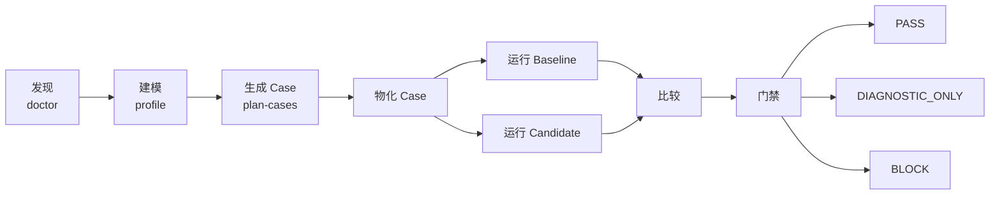

# Agent Workflow Bench

**面向 Coding Agent 工作流的证据优先回归测试与发布门禁。**

[English](README.md) · [简体中文](README.zh-CN.md) · [日本語](README.ja.md)

Agent Workflow Bench（AWB）评测的是 Coding Agent 周围的完整工作流，而不只是
最终回答。它覆盖规则、Skill、Hook、子 Agent、路由、Handoff、Gate、制品、状态、
预算、副作用策略和中断恢复。

产品名称统一为 **Agent Workflow Bench**；package、仓库、plugin、Skill 和 command
的 canonical slug 统一为 `agent-workflow-bench`，CLI 为 `awb`。

> AWB 以证据为先。确定性合约违规和无效 provenance 优先于综合分数与 AI 判断。
> simulated、证据不完整或不可比较的运行不能产生真实 CI PASS。

## AWB 能做什么

AWB 将工作流期望转成版本化合约，推导覆盖目标，生成可执行 case，采集证据，
对齐 baseline 与 candidate 后进行比较，最后给出确定性的发布结论。



| 评测领域 | 示例 |
| --- | --- |
| 合约完整性 | 入口、角色、Owner、状态、必需 Join |
| 路由与 Gate | 禁止路由、Owner 绕过、假 PASS、缺失回调 |
| 制品与状态 | 文件缺失、路径错误、状态过期或非法 |
| 副作用 | 禁止命令、外部写入、生产操作 |
| 执行质量 | 必需证据、真实完成、中断恢复 |
| 效率 | 耗时、重试、重复工作、Token 使用 |
| 测评器质量 | 覆盖率、Mutation kill rate、漏报与可复现性 |

## 安装

### 环境要求

- Node.js 和 npm，建议使用当前 LTS。
- 使用对应 live runner 时需要 Codex 或 Claude Code。
- simulated 运行不需要真实 Coding Agent CLI。

请将示例中的 `GITHUB_OWNER` 替换为实际托管仓库的账号或组织。

### 从源码运行

```bash
git clone https://github.com/GITHUB_OWNER/agent-workflow-bench.git
cd agent-workflow-bench
npm install
npm run validate
npm run benchmark -- --help
```

### 安装 Codex Plugin

```bash
codex plugin marketplace add \
  https://github.com/GITHUB_OWNER/agent-workflow-bench \
  --ref main

codex plugin add \
  agent-workflow-bench@agent-workflow-bench
```

### 安装 Claude Code Plugin

在 Claude Code 中执行：

```text
/plugin marketplace add GITHUB_OWNER/agent-workflow-bench
/plugin install agent-workflow-bench@agent-workflow-bench
/reload-plugins
```

Plugin 内置独立 JavaScript runtime、schema、config、fixture、Skill、command 和
`bin/awb` wrapper。

## 快速开始

下面的安全本地流程不会调用真实 Coding Agent，但会完整经过发现、配对比较和 Gate：

```bash
awb doctor \
  --target minimal-directory-agent \
  --runner simulated \
  --out reports/doctor

awb run \
  --target minimal-directory-agent \
  --runner simulated \
  --execution simulated \
  --out reports/regression/baseline

awb run \
  --target minimal-directory-agent \
  --runner simulated \
  --execution simulated \
  --out reports/regression/candidate

awb compare \
  --baseline reports/regression/baseline \
  --candidate reports/regression/candidate \
  --out reports/regression/comparison

awb gate \
  --comparison reports/regression/comparison/comparison-result.json \
  --out reports/regression/gate
```

最后一个命令返回退出码 `2`，这是预期结果：simulated 证据可以验证 harness 和
scorer，但证据等级仍是 `DIAGNOSTIC_ONLY`。

源码运行时可将 `awb ...` 替换为 `npm run benchmark -- ...`。

## CI Gate 与信任边界

### Gate 结论

| 结论 | 退出码 | 含义 |
| --- | ---: | --- |
| `PASS` | `0` | 已通过资格认证的独立 live `workflow_trace`，且没有阻断性回归 |
| `DIAGNOSTIC_ONLY` | `2` | simulated、Observer 未认证、证据不完整或不可比较 |
| `BLOCK` | `1` | Hard Failure、回归、无效 provenance 或工具失败 |

当前已实现的 Hard Failure 永远优先于分数：禁止路由、Owner 绕过、假 PASS、缺失必需
Join、artifact path drift、不安全生产副作用、无效 provenance 和未注册失败码。runner
失败与 telemetry 不足属于独立的确定性 BLOCK/诊断条件，不是额外的 registry code。

### 当前 Runner 证据等级

| Runner | 当前证据边界 | Gate 影响 |
| --- | --- | --- |
| Codex | live `contract_summary` | 没有外部观察时仅用于诊断 |
| Claude Code | live `contract_summary` | 没有外部观察时仅用于诊断 |
| OpenCode | capability detection | 需要独立 adapter |
| Simulated | synthetic events | 仅验证 harness/scorer |

### 签名 Workflow Trace 准入

独立 observer 可以使用 Ed25519 对完整标准化 Trace 签名。AWB 只接收签名后的
Trace 和独立配置的公钥：

```bash
awb ingest-trace \
  --cases-dir cases/generated/my-workflow \
  --suite full \
  --trace observer-output/workflow-trace.json \
  --trusted-observer-key ci/observer-public.pem \
  --out reports/observed/baseline

awb compare \
  --baseline reports/observed/baseline \
  --candidate reports/observed/candidate \
  --trusted-observer-key ci/observer-public.pem \
  --out reports/observed/comparison

awb gate \
  --comparison reports/observed/comparison/comparison-result.json \
  --trusted-observer-key ci/observer-public.pem \
  --out reports/observed/gate
```

AWB 会重新验证签名、case 集合、生命周期证据、provenance、runtime manifest、
comparison snapshot 和 gate 重算。Trace 被修改、公钥错误、case 缺失、证据缺失或
没有 trust anchor 时都不能 PASS。

签名只能证明 observer 身份和签名后的完整性，不能证明 observer 采集完备性或
OS/网络隔离有效性。将公钥加入发布信任根前，必须先鉴定 observer。规范见
[Workflow-Trace Observer Contract](docs/workflow-trace-observer-contract.md)。
当前 Stage 1 导入路径会记录 `qualificationStatus: missing`，因此即使签名和公钥
验证成功也只能得到 `DIAGNOSTIC_ONLY`；真实 `GATE-PASS` 保留给 Stage 3
生成并验证完整性绑定 qualification artifact 之后的证据。手工把可编辑运行元数据
改成 `valid` 不会生效。

## 常用工作流

### Baseline/Candidate 配对回归

使用隔离 checkout，并保持 target contract、case 集合、runner、权限、预算和验证条件一致：

```bash
awb run \
  --target my-workflow \
  --target-root <baseline-checkout> \
  --runner codex \
  --execution live \
  --mode diagnostic \
  --out reports/regression/baseline

awb run \
  --target my-workflow \
  --target-root <candidate-checkout> \
  --runner codex \
  --execution live \
  --mode diagnostic \
  --out reports/regression/candidate

awb compare \
  --baseline reports/regression/baseline \
  --candidate reports/regression/candidate \
  --out reports/regression/comparison
```

Claude Code 使用 `--runner claude`。内置 live adapter 在通过可信 Workflow Trace
准入前仍然只能产生诊断级证据。

### 一条命令完成评测

```bash
awb evaluate \
  --target my-workflow \
  --target-root <candidate-checkout> \
  --planner-runner codex \
  --runner codex \
  --coverage-mode full \
  --execution live \
  --out reports/evaluations/my-workflow
```

`smoke` 用于快速反馈，`full` 用于广覆盖，`adaptive` 用于针对缺失覆盖生成后续 case。

### 接入新工作流

```bash
awb init-target \
  --agent-root path/to/workflow \
  --target-id my-workflow \
  --name "My Workflow" \
  --out configs/targets/my-workflow.draft.yaml
```

检查生成的 gap report，确认 Owner、Join、Route、Artifact、State、预算和命令策略，
再注册经 Owner 审核的 target pack。自动生成的 draft 不是可信合约。

### 自测与 Mutation 验证

```bash
awb debug reverse-validate \
  --target my-workflow \
  --suite smoke \
  --mutation-set fixtures/mutations/extended.yaml \
  --runner simulated \
  --out .benchmark-debug/my-workflow
```

Mutation overlay 用于验证 scorer 和 oracle，不会修改目标源码，也不能证明 live
runner 的真实行为。

## 命令与制品

| 命令 | 用途 |
| --- | --- |
| `doctor` | 发现 target、runner 和证据就绪度 |
| `init-target` | 生成可审阅的 target-pack draft |
| `profile` | 构建稳定的工作流 `ContractModel` |
| `plan-cases` | 按合约覆盖目标生成 case |
| `materialize` | 生成可执行 Case YAML 与 manifest |
| `run` | 执行单 case 或 suite |
| `evaluate` | 执行 profile、规划、case、评分和报告 |
| `ingest-trace` | 验证并评分独立签名的 live trace |
| `compare` | 比较匹配的 baseline/candidate 证据 |
| `gate` | 执行确定性 CI 发布策略 |
| `score` / `report` | 查看或渲染已有运行 |
| `debug ...` | 反向验证并诊断 benchmark harness |

| 制品 | 用途 |
| --- | --- |
| `contract-model.json` | 标准化 target 合约 |
| `ai-case-plan-validation.json` | 覆盖与绑定校验 |
| `events/*` / `case-results/*` | 每个 case 的证据与结论 |
| `suite-result.json` | 单次运行汇总 |
| `runtime-manifest.json` | 实际 runner/runtime 事实 |
| `provenance.json` | Target、case、环境和完整性身份 |
| `workflow-trace.json` | 独立签名的标准化 live trace |
| `comparison-result.json` | 完整性绑定的配对比较 |
| `gate-result.json` | 确定性发布结论 |
| `report.md` | 人读诊断与建议 |

完整参数请执行 `awb <command> --help`。

## 安全与隐私

- 使用 `--target-root` 隔离 baseline 和 candidate。
- simulated fixture 不会调用外部 Agent。
- 持久化制品会过滤常见凭据、邮箱和绝对路径。
- provenance 将结果绑定到 target、Git、config、case、runner 和制品。
- 签名前必须先完成 Trace 脱敏。
- observer 私钥绝不能提供给被测 runner。
- 确定性副作用失败优先于综合分数。
- 企业 Target Pack 应保留在公共核心仓库之外。

不要让不可信 target 连接生产凭据或生产服务。诊断 Prompt 本身不是 Sandbox。

## 开发

```bash
npm install
npm run typecheck
npm test
npm run validate
npm run plugin:build
```

从源码目录之外验证打包 runtime：

```bash
plugins/agent-workflow-bench/bin/awb validate-schema
```

`plugins/agent-workflow-bench/runtime/` 是需要提交的生成物。修改 runtime 行为、
schema、config 或 fixture 后必须执行 `npm run plugin:build`。

```text
.
├── configs/                     # Runner Config 与 Target Pack
├── fixtures/                    # 通用 Target 与 Mutation 场景
├── plugins/agent-workflow-bench # Codex/Claude Plugin 与 Bundled Runtime
├── schemas/                     # 机器可读制品合约
├── src/                         # TypeScript CLI
├── tests/                       # 单元与端到端测试
└── docs/                        # 方法论与操作文档
```

## 文档

- [建设方案说明](docs/agent-workflow-bench-human-guide.md)
- [Plugin 使用说明](docs/agent-workflow-bench-plugin-guide.md)
- [测评方法论](docs/ai-workflow-evaluation-methodology.md)
- [Workflow-Trace Observer Contract](docs/workflow-trace-observer-contract.md)
- [English README](README.md)
- [日本語 README](README.ja.md)

## 许可证

Agent Workflow Bench 采用 [MIT License](LICENSE) 发布。
