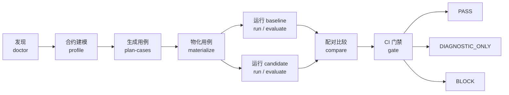
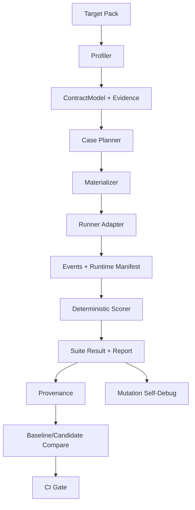

# Agent Workflow Bench

**面向 Coding Agent 工作流的 CI 级回归测试与发布门禁。**

[English](README.md) · [简体中文](README.zh-CN.md) · [日本語](README.ja.md)

Agent Workflow Bench（AWB）用于发现、评测、比较和门禁 Codex、Claude Code
等 Coding Agent 的工作流。它关注的不只是单个 Prompt 或模型回答质量，而是模型周围
的完整工作流：规则、Skills、Hooks、子 Agent、路由、Handoff、Gate、制品、状态、
预算和副作用策略。

产品展示名称是 **Agent Workflow Bench**；为保持兼容，命令行仍为 `awb`，package、
plugin 和仓库标识仍为 `agent-workflow-benchmark`。

> AWB 以证据为先。确定性合约违规和无效 provenance 优先于综合评分与 AI 判断。
> simulated、证据不完整或不可比较的运行不能产生真实 CI PASS。

## 为什么需要 AWB

Coding Agent 工作流本质上已经接近软件系统，但很多变更仍缺少软件级的回归证据。
一处规则、Skill、Hook、路由或子 Agent 合约的改动，可能悄然改变：

- 谁应该负责某类任务；
- 必需 Review、Join 和回调是否真正发生；
- Gate 是否诚实地输出 PASS；
- 制品和状态写到哪里；
- 哪些工具或副作用被允许；
- 工作流消耗多少时间和上下文；
- 中断后能否恢复而不是从头重跑。

AWB 将这些预期收敛为可版本化的 Target Pack，生成或物化可执行用例，收集可追溯
证据，在匹配条件下比较 baseline 与 candidate，并输出确定性的发布判定。

## 核心流程



推荐入口：

1. `awb doctor`：发现目标工作流，检查 runner，并说明当前证据上限。
2. `awb run` 或 `awb evaluate`：在隔离环境中运行 baseline 和 candidate。
3. `awb compare`：比较匹配条件下的两组证据。
4. `awb gate`：输出机器可读与人类可读的 CI 判定。

原有 profile、规划、物化、评分、报告、P0 和自身 Debug 命令继续保留。

## AWB 评测什么

| 范围 | 典型内容 |
| --- | --- |
| 合约完整性 | Entrypoint、角色、Owner、状态、必需 Join |
| 路由 | 必需路由、禁止路由、回调所有权 |
| Gate | 伪 PASS、跳过必检项、非法终态 |
| 制品和状态 | 缺失文件、错误路径、Owner 错误、过期状态 |
| 副作用 | 禁止命令、外部写入、生产操作 |
| 执行有效性 | 必需证据、真实完成、恢复能力 |
| 执行效率 | 耗时、重试、重复工作 |
| Token 使用 | 输入、输出、总量、浪费量、置信度 |
| 可解释性 | Oracle ID、分数上限、硬失败、provenance |
| Harness 质量 | Mutation 捕获率、漏报、可复现性 |

## 功能总览

| 命令 | 用途 | 主要产物 |
| --- | --- | --- |
| `awb doctor` | 发现 Target，检查 runner 与证据就绪度 | `doctor-result.json`、`doctor-report.md` |
| `awb init-target` | 生成可评审的 Target Pack 草稿 | Target YAML、缺口报告 |
| `awb profile` | 构建稳定的工作流 `ContractModel` | Profile evidence、contract JSON |
| `awb plan-cases` | 使用 Codex、Claude 或 fixture 生成用例 | AI plan、验证报告 |
| `awb materialize` | 将计划或模板转为可执行 YAML | Cases、manifest、适用性矩阵 |
| `awb run` | 执行单个 case 或 suite | Events、结果、provenance、建议 |
| `awb evaluate` | 一次完成完整评测流程 | Profile、plan、cases、report、P0 |
| `awb compare` | 比较 baseline 与 candidate | Comparison JSON、Markdown |
| `awb gate` | 执行确定性 CI 门禁 | Gate JSON、Markdown、固定退出码 |
| `awb score` | 查看已有 run 的判定与分数 | JSON 摘要 |
| `awb report` | 渲染可读报告 | Markdown、JSON |
| `awb debug ...` | 验证和改进 Benchmark 自身 | Dossier、修复计划、修复结果 |

使用 `awb <command> --help` 查看完整参数。

## 证据与判定模型

### 比较分类

`awb compare` 输出：

| 分类 | 含义 |
| --- | --- |
| `IMPROVED` | candidate 相比匹配 baseline 有明确改善 |
| `REGRESSED` | candidate 引入可测量退化 |
| `UNCHANGED` | 匹配条件下没有实质变化 |
| `MIXED` | 改善和退化同时存在 |
| `HARD_FAILURE` | candidate 的确定性硬失败主导结果 |
| `INCOMPARABLE` | 条件或 provenance 不支持有效比较 |

### 配对 CI Gate

`awb gate` 使用独立的三态发布合约：

| 判定 | Exit code | 含义 |
| --- | ---: | --- |
| `PASS` | `0` | 可信 live `workflow_trace`，且没有阻断性回归 |
| `DIAGNOSTIC_ONLY` | `2` | 证据是模拟的、不完整的或不可比较 |
| `BLOCK` | `1` | 硬失败、阻断性退化、无效 provenance 或工具失败 |

硬失败始终优先于分数，包括生产副作用、Owner 绕过、伪 PASS、禁止路由、缺失必需
Join、关键制品缺失和无效 provenance。

每次比较都会在 `evidence/` 下保存 baseline/candidate 的 suite、provenance 和 runtime
manifest 快照，记录对应哈希，并将 comparison payload 与这些快照绑定。`awb gate`
会重新验证 bundle 并重新计算 comparison；被编辑的 comparison 或证据文件会直接
触发 `GATE-COMPARISON-INTEGRITY` 并 BLOCK。运行时执行事实还会与 provenance
及 adapter 声明的证据上限进行语义校验，因此仅重算可编辑哈希不能把 simulated 或
contract-summary 运行升级成 `workflow_trace`。

为兼容旧用户，单次运行的 `suite-result.json` 仍使用 `APPROVE`、
`CONDITIONAL_APPROVE`、`BLOCK`、`DIAGNOSTIC_ONLY`。配对 CI Gate 使用
`PASS`、`DIAGNOSTIC_ONLY`、`BLOCK`。

### 证据层级

AWB 明确记录证据来源和观测边界：

- **Live workflow trace**：可信且完整时可用于 PASS。
- **Live contract summary**：可用于诊断，但不足以 PASS。
- **Simulated events**：只用于确定性 harness/scorer 验证。
- **推断证据**：从已记录事实得到的解释。
- **未知**：缺失或无法观测。

只有可信 adapter 输出真实 `workflow_trace` 时，配对 CI Gate 才能 PASS。当前
Codex/Claude `contract-summary` adapter 和 simulated run 即使分数很高，也只能
得到 `DIAGNOSTIC_ONLY`。

## Runner 支持

| Runner | 用例规划 | Case 执行 | 当前证据边界 |
| --- | --- | --- | --- |
| Codex | Live | Live adapter | Contract summary；没有 workflow trace 时仅诊断 |
| Claude Code | Live | Live adapter | Contract summary；没有 workflow trace 时仅诊断 |
| OpenCode | 能力检测 | Adapter 扩展点 | Capability-only |
| Simulated | Fixture plan | 确定性本地执行 | Synthetic evidence；仅诊断 |

Runner 版本、可执行文件能力、Token 置信度、执行模式和可比性都会写入 provenance，
而不是由工具假设。

## 安装

### 环境要求

- Node.js 和 npm，推荐当前 LTS 版本。
- 使用对应 live runner 时需要 Codex 或 Claude Code。
- 从私有远端安装时，需要具备仓库 Git 访问权限。

Simulated run 不需要 Coding Agent CLI。

请将安装示例中的 `GITHUB_OWNER` 替换为实际托管该仓库副本的 GitHub 账号或组织。

### 从源码运行

```bash
git clone https://github.com/GITHUB_OWNER/agent-workflow-benchmark.git
cd agent-workflow-benchmark
npm install
npm run validate
```

运行 TypeScript CLI：

```bash
npm run benchmark -- --help
npm run benchmark -- doctor \
  --target minimal-directory-agent \
  --runner simulated \
  --out reports/doctor
```

下文统一使用 `awb ...`。源码方式可以替换成 `npm run benchmark -- ...`。

### 作为 Codex Plugin 安装

```bash
codex plugin marketplace add \
  https://github.com/GITHUB_OWNER/agent-workflow-benchmark \
  --ref main

codex plugin add \
  agent-workflow-benchmark@agent-workflow-benchmark
```

### 作为 Claude Code Plugin 安装

在 Claude Code 中执行：

```text
/plugin marketplace add GITHUB_OWNER/agent-workflow-benchmark
/plugin install agent-workflow-benchmark@agent-workflow-benchmark
/reload-plugins
```

插件内包含编译后的 JavaScript runtime、schemas、configs、fixtures、Skill 和
`bin/awb` wrapper，安装后不依赖源码 checkout。首次执行时 wrapper 会在插件缓存
中安装 production runtime 依赖。

## 快速开始：安全的 Simulated 回归

以下流程不会调用真实 Agent，但能完整验证发现、baseline/candidate 比较和 Gate：

```bash
awb doctor \
  --target minimal-directory-agent \
  --runner simulated \
  --out reports/doctor

awb run \
  --target minimal-directory-agent \
  --runner simulated \
  --execution simulated \
  --out reports/regression/baseline

awb run \
  --target minimal-directory-agent \
  --runner simulated \
  --execution simulated \
  --out reports/regression/candidate

awb compare \
  --baseline reports/regression/baseline \
  --candidate reports/regression/candidate \
  --out reports/regression/comparison

awb gate \
  --comparison reports/regression/comparison/comparison-result.json \
  --out reports/regression/gate
```

最后一个命令返回退出码 `2`，因为 simulated evidence 只能用于诊断。这是预期结果。

## Baseline/Candidate 配对回归

使用两个隔离 checkout，并确保 task、Target Pack、case set、runner、执行模式、权限、
预算和验证条件保持一致：

```bash
awb doctor \
  --target my-workflow \
  --target-root <baseline-checkout> \
  --runner codex \
  --out reports/doctor-baseline

awb run \
  --target my-workflow \
  --target-root <baseline-checkout> \
  --runner codex \
  --execution live \
  --mode diagnostic \
  --out reports/regression/baseline

awb run \
  --target my-workflow \
  --target-root <candidate-checkout> \
  --runner codex \
  --execution live \
  --mode diagnostic \
  --out reports/regression/candidate

awb compare \
  --baseline reports/regression/baseline \
  --candidate reports/regression/candidate \
  --out reports/regression/comparison

awb gate \
  --comparison reports/regression/comparison/comparison-result.json \
  --out reports/regression/gate
```

Claude 使用同样流程，将 runner 改为 `claude`。自定义 adapter 必须提供可信
workflow trace，最终 Gate 才可能返回 PASS。

## 一条命令完成完整评测

`evaluate` 保留 AI-first 评测流程，适合生成详细诊断、修改建议和 P0 记录：

```bash
awb evaluate \
  --target my-workflow \
  --target-root <candidate-checkout> \
  --planner-runner codex \
  --runner codex \
  --coverage-mode full \
  --execution live \
  --out reports/evaluations/my-workflow
```

确定性本地验证：

```bash
awb evaluate \
  --target minimal-directory-agent \
  --planner-runner fixture \
  --runner simulated \
  --coverage-mode smoke \
  --execution simulated \
  --out reports/evaluations/minimal-directory-agent
```

覆盖模式：

- `smoke`：有上限的快速反馈。
- `full`：广泛覆盖工作流合约。
- `adaptive`：针对缺失覆盖继续生成。

`--max-cases` 只限制单次规划数量，不代表已经覆盖完整工作流。

## 接入新的工作流

生成 Target Pack 草稿：

```bash
awb init-target \
  --agent-root path/to/workflow \
  --target-id my-workflow \
  --name "My Workflow" \
  --target-type directory \
  --out configs/targets/my-workflow.draft.yaml
```

结合生成的 gap report，确认：

- Entrypoint 和角色；
- Owner scope 和 required owner；
- 状态与 GatePolicy；
- 必需 Join 与回调；
- 制品和状态路径；
- 禁止路由；
- Wall-clock 和 Token 预算；
- 允许命令和禁止参数。

评审后将文件移动到 `configs/targets/my-workflow.yaml`，并注册到
`configs/targets/registry.yaml`。生成的草稿在工作流 Owner 评审前不是可信合约。

Target 类型：

- `directory`：目录树中的规则、Skills、Hooks 和状态；
- `cli`：命令驱动工作流；
- `hybrid`：目录合约加可执行 Entrypoint。

## 主要制品

| 制品 | 用途 |
| --- | --- |
| `doctor-result.json` | 机器可读的就绪度和证据上限 |
| `contract-model.json` | 规范化工作流合约 |
| `profile-evidence.json` | 带哈希的结构化证据 |
| `ai-case-plan.json` | 生成的用例计划 |
| `ai-case-plan-validation.json` | 覆盖与绑定校验 |
| `manifest.json` | 物化用例清单和哈希 |
| `events/*.jsonl` | Runner 或 simulator 结构化事件 |
| `case-results/*.json` | 单 case 判定、分数、证据和失败 |
| `suite-result.json` | 单次运行汇总 |
| `runtime-manifest.json` | Runner 与 runtime 能力 |
| `provenance.json` | Target、Git、配置、runner、环境和完整性哈希 |
| `recommendations.json` / `.md` | 按优先级排列的工作流修改建议 |
| `p0-cases.json` / `.md` | 可持久化的硬失败记录 |
| `comparison-result.json` | 与证据完整性绑定的 Baseline/candidate 分类 |
| `gate-result.json` | 确定性配对 CI 判定 |
| `report.md` | 人类可读评测报告 |

持久化制品会避免写入原始源码片段、凭证、本地绝对路径、个人身份和环境密钥。

## 评分与可解释性

每个 case result 可包含：

- 原始分和应用上限后的分数；
- Verdict 和 hard-failure code；
- Telemetry 完整性；
- Contract、routing、ownership、gate、artifact、join、side-effect、efficiency
  和 runner 等维度；
- Wall-clock 耗时；
- 输入、输出、总量、浪费 Token 及置信度；
- Oracle 和 score provenance；
- Workflow、效率和 Token 成本可比性。

Suite result 汇总这些维度并生成整改建议和 P0 记录。分数用于解释诊断质量，不能覆盖
确定性硬失败，也不能证明工具没有真实观测到的事实。

## 自身 Debug 与 Mutation 验证

AWB 可以检查自己的 scorer 和 oracle 能否发现已知坏信号。Mutation validation 使用
overlay 和 simulated runner，不修改被测 Target 源码：

```bash
awb debug prepare-env \
  --target my-workflow \
  --suite smoke \
  --runner codex \
  --out .benchmark-debug/my-workflow-env

awb debug reverse-validate \
  --target my-workflow \
  --suite smoke \
  --mutation-set fixtures/mutations/extended.yaml \
  --runner simulated \
  --suite-result reports/runs/my-workflow/suite-result.json \
  --out .benchmark-debug/my-workflow

awb debug diagnose \
  --debug-run .benchmark-debug/my-workflow \
  --out .benchmark-debug/my-workflow/diagnosis

awb debug propose-fix \
  --dossier .benchmark-debug/my-workflow/diagnosis/debug-dossier.json \
  --out .benchmark-debug/my-workflow/diagnosis/repair-plan.md
```

Debug health 与被测工作流分数分开呈现。

## 安全与隐私

AWB 面向隔离环境中的回归测试：

- 使用 `--target-root` 隔离 baseline 和 candidate；
- Simulated fixture 不调用外部 Agent；
- Codex live 执行请求 read-only/no-approval sandbox；Claude live 执行使用
  Claude CLI 默认权限；当前两种 adapter 都只能产生诊断证据；
- 确定性副作用失败优先于分数；
- Provenance 绑定 Target、Git、配置、case、runner 和制品；
- 持久化 planner 制品不保留原始源码摘录和原始模型输出；
- 对凭证、邮箱、绝对路径和常见密钥格式进行脱敏；
- 公共核心只包含通用 fixture，企业 Target 作为外部输入。

不要为不可信 Target 配置生产凭证或生产服务。诊断 Prompt 本身不等于 Sandbox。

## 架构



Runner 接口保持可扩展；工作流特定的 live 观测逻辑应放在 Adapter 中，而不是硬编码
到通用核心。

## 开发与验证

```bash
npm install
npm run typecheck
npm test
npm run validate
npm run plugin:build
```

验证插件 wrapper：

```bash
plugins/agent-workflow-benchmark/bin/awb validate-schema
```

`plugins/agent-workflow-benchmark/runtime/` 下的生成 runtime 会随仓库提交。任何影响
runtime 行为、schema、配置或 fixture 的源码变更，都需要重新构建并验证 bundled
runtime。

仓库结构：

```text
.
├── configs/                         # Runner 配置和 Target Pack
├── fixtures/                        # 通用 Target 与 Mutation 场景
├── plugins/agent-workflow-benchmark # Codex/Claude Plugin 与 bundled runtime
├── schemas/                         # 机器可读制品合约
├── src/                             # TypeScript CLI
├── tests/                           # 单元和端到端测试
└── docs/                            # 方法论与操作指南
```

## 当前边界

- 当前 Codex/Claude live adapter 提供 contract-summary evidence，尚未独立观测真实
  Target Entrypoint 执行或 Tool Trace。
- OpenCode 已进入能力检测和 runner metadata；live 执行仍需要 adapter。
- 只有 runner 原生提供 Token 数据时才会记录实际用量，否则会标记来源和置信度不可用。
- 只有 workflow、效率和 Token 三个轴可比较时，才输出跨 runner 排名。
- 插件首次使用时会在插件缓存目录中安装 runtime 依赖。

## 相关文档

- [用户指南](docs/agent-workflow-benchmark-human-guide.md)
- [插件指南](docs/agent-workflow-benchmark-plugin-guide.md)
- [评测方法论](docs/ai-workflow-evaluation-methodology.md)
- [English README](README.md)
- [日本語 README](README.ja.md)
